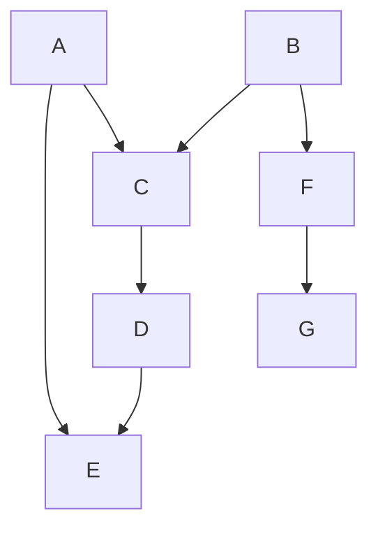
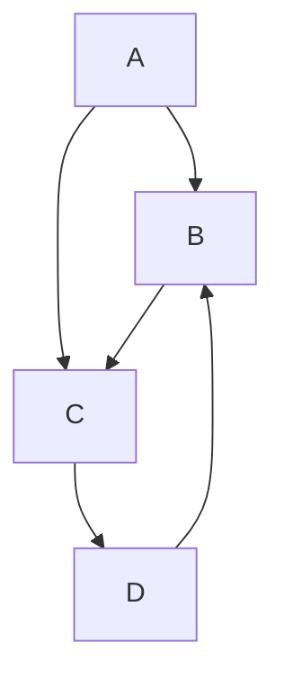

```
layers = list[list[Node]]
while unsolved is not empty:
    layer = list[Node]
    for all nodes in unsolved:
        if node dependencies are all solved:
            add node to layer
            remove node from nodes
    if layer is empty:
        error, impossible case
    add layer to layers
return layers
```


# Possible
`python .\case_1.py`



# Impossible

`python .\case_2.py`

