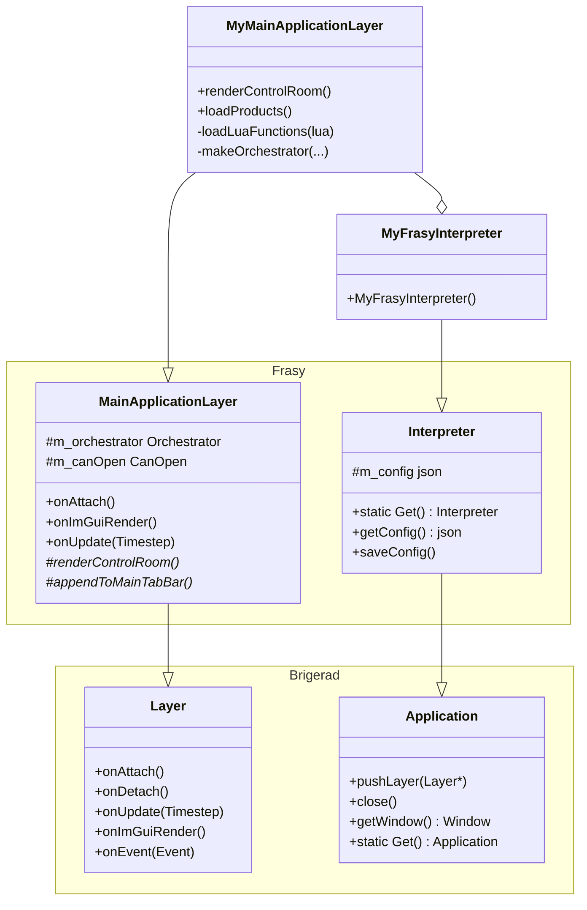

# C++ Layer

The C++ layer is the host process of a Frasy application. It provides the application lifecycle, windowing, UI rendering, hardware communication, and the test engine. Applications extend a small set of framework classes to customize behavior.

---

## Class Hierarchy



---

## Entry Point: `Frasy::Interpreter`

`Frasy::Interpreter` subclasses `Brigerad::Application`. It is the application **singleton** — only one instance may exist.

### Responsibilities

- Loading and persisting `config.json` (read at construction, saved at destruction and on demand).
- Managing the lifetime of the `MainApplicationLayer` (pushed onto the layer stack at construction).
- Providing global access via `Frasy::Interpreter::Get()`.

### Application-Defined Subclass

The application creates a subclass (e.g., `MyFrasyInterpreter`) that:

1. Sets the window title by passing it to the base constructor.
2. Optionally initializes product-specific config keys.
3. Pushes the main layer onto the layer stack.

```cpp
class MyFrasyInterpreter : public Frasy::Interpreter {
public:
    MyFrasyInterpreter() : Interpreter("My App Title") {
        // Initialize product-specific config if needed
        if (m_config["MyProduct"].empty()) {
            m_config["MyProduct"] = nlohmann::json::object();
        }
        pushLayer(new MyMainApplicationLayer());
    }
};
```

### Brigerad Entry Point

The framework discovers the application through `Brigerad::CreateApplication()`:

```cpp
Brigerad::Application* Brigerad::CreateApplication(int argc, char** argv) {
    return new MyFrasyInterpreter();
}
```

This function is called by Brigerad's `main()` (provided via `Brigerad/Core/EntryPoint.h`).

---

## Main Layer: `Frasy::MainApplicationLayer`

`MainApplicationLayer` subclasses `Brigerad::Layer` and is the primary UI layer. It owns all built-in panels, the test engine (orchestrator), and the hardware bus (CANopen).

### Lifecycle Methods

| Method | Called When | What It Does |
|---|---|---|
| `onAttach()` | Layer pushed to stack | Initializes panels, loads textures, sets up the orchestrator |
| `onDetach()` | Layer popped | Cleans up resources |
| `onUpdate(Timestep)` | Every frame (before render) | Processes hotkeys, handles post-test actions |
| `onImGuiRender()` | Every frame (render pass) | Draws the menu bar, control room, all panels |
| `onEvent(Event&)` | On input events | Dispatches keyboard/mouse events |

### Owned Components

```cpp
// Panels
std::unique_ptr<LogWindow>            m_logWindow;
std::unique_ptr<DeviceViewer>         m_deviceViewer;
std::unique_ptr<CanOpenViewer::Layer> m_canOpenViewer;
std::unique_ptr<ResultViewer>         m_resultViewer;
std::unique_ptr<ResultAnalyzer>       m_resultAnalyzer;
std::unique_ptr<TestViewer>           m_testViewer;

// Core subsystems
CanOpen::CanOpen  m_canOpen;       // Hardware bus
Lua::Orchestrator m_orchestrator;  // Test engine
```

---

## Built-In Panels

All panels are togglable from the **View** menu or via hotkeys:

| Panel | Hotkey | Purpose |
|---|---|---|
| Log Window | F2 | Real-time application log stream with filtering and source location |
| Device Viewer | F3 | Lists detected serial/USB devices and their connection status |
| Result Viewer | F4 | Shows pass/fail results from the last test run |
| Result Analyzer | F5 | Statistical analysis across multiple runs (Cp, Cpk, histograms) |
| Test Viewer | F6 | Inspect the solution tree; enable/disable individual sequences and tests |
| CANopen Viewer | F7 | Browse the live CANopen object dictionary; read/write SDO values |
| Lua Profiler | F8 | Per-function timing for Lua sequences (flame graph and table) |

---

## Override Points

The application-defined subclass (e.g., `MyMainApplicationLayer`) extends the framework by overriding protected virtual methods:

### `renderControlRoom()`

The main operator-facing UI. This is where you build product selection, input fields, and run controls.

```cpp
void MyMainApplicationLayer::renderControlRoom() {
    // Product dropdown, operator name, serial number, run button, UUT status...
}
```

### `appendToMainTabBar()`

Add custom items to the top menu bar alongside the built-in View and Help menus.

```cpp
void MyMainApplicationLayer::appendToMainTabBar() {
    if (ImGui::BeginMenu("Custom")) {
        // ...
        ImGui::EndMenu();
    }
}
```

### Panel Visibility

Programmatically open any built-in panel:

```cpp
makeLogWindowVisible();
makeDeviceViewerVisible();
makeCanOpenViewerVisible();
makeResultViewerVisible();
makeResultAnalyzerVisible();
makeTestViewerVisible();
```

---

## The Orchestrator

`Frasy::Lua::Orchestrator` is the **test engine**. It lives as a member of `MainApplicationLayer` and manages the entire lifecycle of test execution.

### Key API

```cpp
// Load a product's Lua files
bool loadUserFiles(const std::string& environment, const std::string& testsDir);

// Run the full test pipeline (async)
void runSolution(const std::string& operatorName,
                 const std::vector<std::string>& serials,
                 bool regenerate,
                 bool skipVerification,
                 std::function<void()> onDoneCallback);

// State queries
bool isRunning() const;
UutState getUutState(std::size_t uut) const;
const Models::Solution& getSolution();

// Control
void toggleUut(std::size_t index);
void setSequenceEnable(const std::string& sequence, bool enable);
void setTestEnable(const std::string& sequence, const std::string& test, bool enable);
void generate();  // Force re-generation of the solution
```

### Extension Callbacks

The application can inject custom behavior into the Lua environment:

```cpp
// Add custom Lua functions available in test scripts
m_orchestrator.setLoadUserFunctions([](sol::state_view lua) {
    lua["MyCustomFunction"] = [](int x) { return x * 2; };
});

// Add custom board definitions
m_orchestrator.setLoadUserBoards([](sol::state_view lua) -> sol::table {
    auto t = lua.create_table();
    // ...
    return t;
});

// Provide GUI values to Lua (available at Context.values.gui)
m_orchestrator.setLoadUserValues([](sol::state_view lua) -> sol::table {
    auto t = lua.create_table();
    t["temperature"] = readTemperature();
    return t;
});
```

---

## The CANopen Bus

`Frasy::CanOpen::CanOpen` manages hardware communication. It is owned by `MainApplicationLayer` and shared with the orchestrator.

### Typical Initialization

When a product is loaded, the application configures the CANopen bus based on the environment's IB declarations:

```cpp
m_canOpen.stop();
m_canOpen.clearNodes();

for (const auto& ib : environment.ibs) {
    m_canOpen.addNode(ib.nodeId, ib.name, ib.edsPath);
}

m_canOpen.start();
m_orchestrator.setCanOpen(&m_canOpen);
```

See [Hardware Communication](hardware.md) for the full CANopen architecture.

---

## Configuration (`config.json`)

The config file is a JSON document managed by `Frasy::Interpreter`. It persists UI state, communication settings, and application-specific data.

```json
{
  "LogWindow": { "AutoScroll": true, "EntriesToShow": 4096, ... },
  "UserConfigPath": "usr_config.json",
  "communication": {
    "usbWhitelist": [{ "vid": 1155, "pid": 42180, "mi": 0 }]
  },
  "LastProduct": "my-product"
}
```

- **`LogWindow`** — log panel display settings.
- **`communication.usbWhitelist`** — VID/PID/MI filters for identifying the SLCAN USB adapter.
- **`LastProduct`** — remembers the last-selected product across sessions.
- Applications may add arbitrary keys via `Frasy::Interpreter::Get().getConfig()`.

---

## Rendering Architecture

Frasy uses **Dear ImGui** (immediate mode) for all UI rendering, hosted by the Brigerad engine's OpenGL backend.

The rendering flow each frame:

1. Brigerad polls OS events → dispatches to layers.
2. `onUpdate(ts)` is called on all layers (logic tick).
3. ImGui new frame begins.
4. `onImGuiRender()` is called → `MainApplicationLayer` draws the menu bar, then calls `renderControlRoom()` and renders all visible panels.
5. ImGui frame ends → draw calls submitted to OpenGL.

All UI code uses ImGui's immediate-mode API — no retained widget tree.
