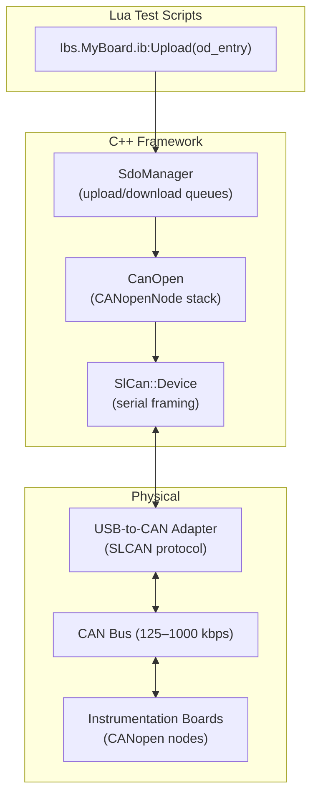

# Hardware Communication

Frasy communicates with test hardware (Instrumentation Boards) using the **CANopen** protocol transported over a **SLCAN** (Serial Line CAN) USB adapter. This page describes the full communication stack from the physical link up to the Lua test scripting layer.

---

## Architecture Overview



---

## SLCAN Transport

### What Is SLCAN?

SLCAN is a simple ASCII protocol that encodes CAN frames over a serial (UART/USB-CDC) connection. It allows standard serial port drivers to carry CAN traffic without dedicated CAN hardware on the host PC.

### USB Adapter Identification

Frasy automatically detects SLCAN-capable hardware by matching USB Vendor ID / Product ID / Interface Number triplets configured in `config.json`:

```json
"communication": {
    "usbWhitelist": [
        { "vid": 1155, "pid": 42180, "mi": 0 }
    ]
}
```

The default triplet (`1155`/`42180`/`0`) corresponds to SMarTest devices (DAQ, PIO, R8L). If you use custom hardware with a different USB identity, add its VID/PID/MI to the whitelist and Frasy will detect it automatically.

Frasy's USB enumerator scans for matching devices at startup and exposes them through the Device Viewer panel.

### SlCan::Device

The `SlCan::Device` class wraps a serial port and handles:

- Opening/closing the physical port.
- Framing CAN packets into the SLCAN ASCII format for transmission.
- A background receive thread that parses incoming SLCAN bytes into `Packet` structures and queues them.
- Muting (discarding incoming packets while muted).
- A callback hook for waking up the CANopen processing thread on new data.

---

## CANopen Stack

Frasy uses the [CANopenNode](https://github.com/CANopenNode/CANopenNode) C library as its protocol stack. The `Frasy::CanOpen::CanOpen` class wraps it and provides a higher-level C++ interface.

### Frasy as a CANopen Node

Frasy itself is a CANopen node on the bus (node ID 0x01 by default). It acts as:

- An **NMT master** — it can reset remote nodes and monitors their operational state.
- An **SDO client** — it initiates SDO upload/download transfers to read/write the object dictionaries of remote nodes.
- A **heartbeat consumer** — it monitors the liveness of instrumentation boards.
- An **emergency consumer** — it receives and logs emergency messages from remote nodes.

### Node Management

```cpp
m_canOpen.addNode(nodeId, "BoardName", "path/to/board.eds");
m_canOpen.start();

// Query state
m_canOpen.isNodeOnNetwork(nodeId);
auto* node = m_canOpen.getNode(nodeId).value();
node->getNmtState();   // CO_NMT_OPERATIONAL, etc.
node->getHbState();    // Heartbeat state

// Lifecycle
m_canOpen.resetNode(nodeId);
m_canOpen.removeNode(nodeId);
m_canOpen.stop();
```

### Threading Model

The CANopen stack runs in its own `std::jthread`. It:

1. Processes incoming CAN frames from all attached SLCAN devices.
2. Runs the CANopenNode `CO_process()` loop (NMT, heartbeat, emergency).
3. Services SDO upload/download requests from worker threads.
4. Sleeps or wakes based on a condition variable triggered by new incoming data.

---

## EDS Files and the Object Dictionary

### What Is an EDS?

An **Electronic Data Sheet** (EDS) is a standardized INI-format file (CiA 306) that describes a CANopen node's capabilities. It lists every object in the node's **object dictionary** — their indexes, sub-indexes, data types, access rights, and default values.

### How Frasy Uses EDS Files

When `Environment.Ib.Add(board)` is called in Lua, the framework:

1. Reads the EDS file specified in the board definition.
2. Parses it with an INI parser.
3. Builds an in-memory Lua table representing the object dictionary.
4. Attaches it to the board as `board.ib.od`.

### Object Dictionary Structure

Each OD entry can be one of three object types:

| Object Type | Description |
|---|---|
| `var` (0x07) | A single variable with one value |
| `array` (0x08) | An indexed array of same-typed sub-entries |
| `record` (0x09) | A struct-like group of named sub-entries |

An entry looks like this in Lua:

```lua
local entry = board.ib.od["Supply Voltage"]
-- entry.parameterName = "Supply Voltage"
-- entry.objectType    = 7 (var)
-- entry.dataType      = 8 (REAL32)
-- entry.accessType    = "ro"
-- entry.index         = "0x2001"
-- entry.subIndex      = "0x0"
-- entry.value         = 0.0 (default, updated on Upload)
```

### Data Types

The EDS parser recognizes all standard CANopen data types:

| Type | ID | Description |
|---|---|---|
| BOOLEAN | 1 | Single bit |
| INTEGER8–64 | 2–21 | Signed integers |
| UNSIGNED8–64 | 5–27 | Unsigned integers |
| REAL32 | 8 | 32-bit float |
| REAL64 | 17 | 64-bit float |
| VISIBLE_STRING | 9 | ASCII string |
| OCTET_STRING | 10 | Byte array |
| DOMAIN | 15 | Arbitrary binary blob |

---

## SDO Operations

**SDO** (Service Data Object) is the CANopen protocol for reading and writing individual object dictionary entries on a remote node. It is a confirmed, request-response protocol.

### Upload (Read from Node)

**Upload** transfers data from a remote node's object dictionary to Frasy.

```lua
-- In a test script:
local voltage = Ibs.MyBoard.ib:Upload(Ibs.MyBoard.ib.od["Supply Voltage"])
```

Under the hood:

1. The Lua `Ib:Upload(ode)` call invokes `CanOpen.__upload(nodeId, ode)`.
2. The C++ binding queues an `SdoUploadRequest` with the `SdoManager` for that node.
3. The SDO worker thread initiates a `CO_SDOclientUploadInitiate` on the CANopen stack.
4. The stack sends a CAN frame (COB-ID = 0x600 + nodeId) to the remote node.
5. The remote node responds with the data.
6. The worker reads the buffer, resolves the future, and returns the value to Lua.

### Download (Write to Node)

**Download** transfers data from Frasy to a remote node's object dictionary.

```lua
-- In a test script:
Ibs.MyBoard.ib:Download(Ibs.MyBoard.ib.od["DAC Output"], 2.5)
```

Under the hood:

1. The Lua `Ib:Download(ode, value)` call invokes `CanOpen.__download(nodeId, ode, value)`.
2. An `SdoDownloadRequest` is queued.
3. The worker initiates a `CO_SDOclientDownloadInitiate`.
4. CAN frame sent (COB-ID = 0x600 + nodeId), remote node acknowledges.

### Complex Entries

For `array` and `record` object types, `Ib:Upload()` and `Ib:Download()` automatically iterate over all sub-entries, performing individual SDO transfers for each.

### Error Handling

SDO operations can fail due to:

- **Timeout** — no response from the node within `sdoTimeoutMs` (default: 1000ms).
- **Abort codes** — the remote node actively rejects the transfer (e.g., non-existent object, access denied).
- **Retries** — each request retries up to 5 times before giving up.

Failures surface as Lua errors that the orchestrator catches and reports.

---

## Heartbeat Monitoring

Frasy monitors instrumentation boards via the CANopen **heartbeat protocol**:

- Each board periodically sends a heartbeat message (its node ID + NMT state).
- Frasy's heartbeat consumer tracks these. If a board stops sending heartbeats within the configured period, it transitions to a **timeout** state.
- A board in timeout is considered **unresponsive** — it may have crashed, lost power, been physically disconnected, or its firmware has hung. SDO operations to a timed-out node will fail, and any test relying on that board should be treated as invalid.
- Heartbeat events trigger callbacks that can be used for error reporting.

Configure per-node heartbeat monitoring:

```cpp
m_canOpen.setNodeHeartbeatProdTime(nodeId, periodMs);
```

!!! note
    The CANopen stack must be restarted after changing heartbeat configuration for the monitoring to take effect.

---

## Emergency Messages

Emergency messages are unsolicited alerts sent by a node when an error condition occurs. Frasy:

1. Receives them via the `emRxCallback`.
2. Logs them to the application log.
3. Stores them in the node's emergency history (`node->getEmergencies()`).
4. Invokes any registered `EmergencyMessageCallback` functions.

```cpp
m_canOpen.addEmergencyMessageCallback([](const EmergencyMessage& em) {
    // React to hardware error conditions
});
```

---

## Integration with the Orchestrator

When a product is loaded:

1. The application reads the environment's IB declarations.
2. For each IB, `addNode(nodeId, name, edsPath)` is called on `m_canOpen`.
3. `m_canOpen.start()` launches the CANopen thread.
4. The orchestrator receives `setCanOpen(&m_canOpen)` so the Lua bindings can invoke SDO operations.

When the product changes or the environment is reloaded:

1. `m_canOpen.stop()` halts the thread.
2. `m_canOpen.clearNodes()` removes all registered nodes.
3. New nodes are added and `start()` is called again.

---

## CANopen Viewer Panel

The built-in CANopen Viewer (++f7++) provides a live UI for:

- Browsing each node's full object dictionary (parsed from EDS).
- Manually initiating SDO upload/download operations.
- Viewing node NMT state and heartbeat status.
- Inspecting emergency message history.

This is invaluable for debugging hardware communication issues during test development.
