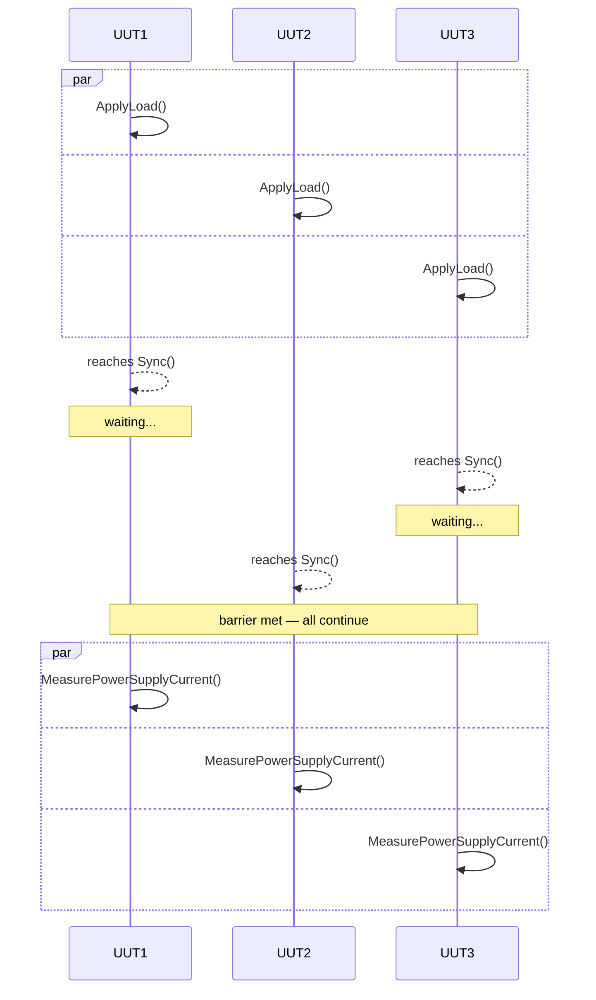
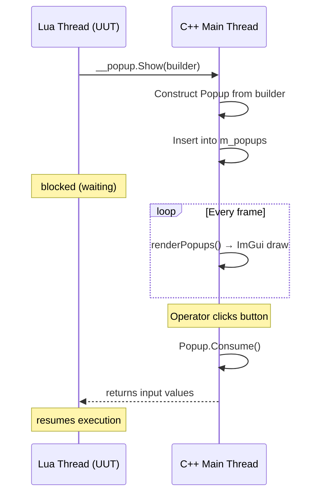

# Lua Layer

The Lua layer is where test engineers define what a board should do and how to verify it. Frasy embeds a Lua 5.4 runtime (via [sol2](https://github.com/ThePhD/sol2)) and provides a rich SDK of globals. The Lua files are loaded, validated, and executed by the C++ orchestrator without requiring a recompile of the application.

---

## Product Structure

A **product** is a directory under `lua/user/` that contains at least an `environment.lua` file:

```
lua/user/
  <product-name>/
    environment.lua         ← required: declares the test environment
    tests/
      *.lua                 ← one or more test files (any depth)
```

The application scans this directory tree at startup (and on ++f9++) to discover available products. The directory name becomes the product name shown in the UI.

!!! tip
    You can have multiple products side-by-side. The operator selects which one to run from a dropdown in the Control Room.

---

## Environment (`environment.lua`)

The environment file declares the **static configuration** of the test setup for this product — how many UUTs, which instrumentation boards are present, and how execution should proceed.

```lua
Environment.Make(function()
    Environment.ScriptVersion("1.0.0")
    Environment.Uut.Count(2)
    Environment.Ib.Add(DAQ:New())
    Environment.SetExecutionPolicy(ExecutionPolicy.parallel)
end)
```

### Environment API

| Function | Purpose |
|---|---|
| `Environment.Make(fn)` | Wraps the environment definition; validates on completion |
| `Environment.ScriptVersion(version)` | Declares the script version string |
| `Environment.Uut.Count(n)` | Sets the number of UUTs (Units Under Test) |
| `Environment.Ib.Add(board)` | Registers an instrumentation board; parses its EDS file |
| `Environment.SetExecutionPolicy(policy)` | `ExecutionPolicy.parallel` or `ExecutionPolicy.sequential` |
| `Environment.UutValue.Add(key)` | Declares a per-UUT value with `.Link(uut, value)` chaining |
| `Environment.Team.Add(leader, ...)` | Groups UUTs into teams for coordinated execution |
| `Environment.Worker.Limit(n)` | Limits the number of concurrent worker threads |
| `Environment.SetOnReport(fn)` | Hook to transform the report before saving |
| `Environment.SetOnReportInfo(fn)` | Hook to inject extra metadata into reports |

---

## Sequences and Tests

Test files define **sequences** (groups of related tests) and the **tests** within them.

```lua
Sequence("Power On", function()
    Requires(Sequence():ToBeFirst())

    Test("Check Supply Voltage", function()
        local daq = Context.map.ibs.daq --[[@as DAQ]]
        local v = daq:MeasureVoltage(Context.values.route._24VDC)
        Expect(v, "Supply Voltage"):ToBeInPercentage(24.0, 5.0):Mandatory()
    end)

    Test("Check Current Draw", function()
        Requires(Test("Check Supply Voltage"):ToPass())
        local i = MeasureCurrent()
        Expect(i, "Current"):ToBeLesser(0.5)
    end)
end)
```

### Rules

- Sequence names must be **unique** across all test files for a product.
- Test names must be **unique within their sequence**.
- A sequence must contain at least one test.
- Test files are loaded in filesystem order; ordering between sequences is expressed via requirements, not file order.

---

## Requirements

Requirements express **constraints** between sequences and tests. They come in two flavors:

### Order Requirements (generation-time)

Influence how the orchestrator sorts sequences into the execution plan:

| Method | Effect |
|---|---|
| `Sequence():ToBeFirst()` | Place this sequence first |
| `Sequence():ToBeLast()` | Place this sequence last |
| `Sequence("Other"):ToBeBefore()` | Current runs before "Other" |
| `Sequence("Other"):ToBeAfter()` | Current runs after "Other" |

### Runtime Requirements (execution-time)

Evaluated live during execution; if unmet, the current scope is **skipped** (not failed):

| Method | Condition |
|---|---|
| `ToPass()` | Target scope completed and all expectations passed |
| `ToFail()` | Target scope did not pass |
| `ToBeComplete()` | Target scope ran (regardless of outcome) |

### Custom Requirements

```lua
Requires(RequirementSpecifier(function()
    return someCondition == true
end))
```

See [Test Lifecycle](test-lifecycle.md) for how requirements interact with the generation and execution stages.

---

## Expectations

Expectations are **assertions** on measured values. They are created with `Expect()` and chained with matchers:

```lua
Expect(value, "name"):ToBeInRange(min, max):Mandatory()
```

### Available Matchers

| Matcher | Assertion |
|---|---|
| `:ToBeTrue()` | Value is boolean `true` |
| `:ToBeFalse()` | Value is boolean `false` |
| `:ToBeEqual(expected)` | Value equals expected (type and value) |
| `:ToBeNear(expected, deviation)` | `expected ± deviation` |
| `:ToBeInRange(min, max)` | `min ≤ value ≤ max` |
| `:ToBeInPercentage(expected, pct)` | `expected ± (expected × pct/100)` |
| `:ToBeGreater(min)` | `value > min` |
| `:ToBeGreaterOrEqual(min)` | `value ≥ min` |
| `:ToBeLesser(max)` | `value < max` |
| `:ToBeLesserOrEqual(max)` | `value ≤ max` |
| `:ToBeType(typeName)` | `type(value) == typeName` |
| `:ToMatch(pattern)` | String matches Lua pattern |

### Modifiers

| Modifier | Effect |
|---|---|
| `:Mandatory()` | If this expectation fails, immediately abort the current test |
| `:Not()` | Inverts the assertion (e.g., `:Not():ToBeTrue()` asserts false) |
| `:ExportAs(name)` | Exports the value for use in later tests |
| `:OnErrorExtra(table)` | Attaches extra debug info to the result on failure |
| `:Show()` | Registers the expectation result for display in the Result Viewer panel |

---

## Multi-UUT Coordination

When testing multiple boards simultaneously (e.g., `Environment.Uut.Count(2)`), each UUT runs through the same test scripts in its own thread. Most of the time they execute independently and in parallel. However, real test fixtures often have **shared resources** (a single power supply, a shared communication bus, a calibration reference) or require **coordinated timing** (applying a load to all boards at the same instant).

Frasy provides three synchronization primitives to handle these cases:

### `Sync()`

Inserts a **barrier** — all enabled UUTs must reach the same `Sync()` point before any of them continues.

**When to use it:** When you need all boards to perform an action at the same time — for example, simultaneously applying a load to verify that a shared power rail doesn't sag, or ensuring all boards are in a known state before a cross-talk measurement.

```lua
Test("Simultaneous Load", function()
    ApplyLoad()       -- each UUT prepares independently
    Sync()              -- everyone waits here until all UUTs have applied their load

    local i = MeasurePowerSupplyCurrent()
    Expect(i, "Current"):ToBeInRange(1.0, 1.2)
end)
```



### `Exclusive(id, fn)`

A **mutex** — only one UUT at a time may execute the protected function. Other UUTs wait their turn.

**When to use it:** When multiple UUTs need to access a shared physical resource that can't handle concurrent access — for example, a single programmable power supply, a shared I²C bus, or a calibration instrument that serves all slots.

The `id` parameter identifies *which* mutex to use. Different IDs are independent mutexes, so you can protect different resources without unnecessary blocking.

```lua
Exclusive(1, function()
    -- Only one UUT at a time can talk to the shared power supply
    sharedPowerSupply:setVoltage(5.0)
    sharedPowerSupply:waitStable()
end)

Exclusive(2, function()
    -- A different mutex for a different shared resource
    sharedMultimeter:measure()
end)
```

### `Once(fn)`

Executes a function **exactly once** across all UUTs, regardless of how many call it. The first UUT to reach the call runs it; all others skip it.

**When to use it:** For one-time setup actions that affect all UUTs equally — calibrating a shared fixture, initializing a shared instrument, or loading a reference dataset that all boards will use.

`Once` is scoped per call-site — it uses a hash of the call's traceback and the current scope to identify uniqueness. This means two different `Once()` calls in different tests will each run once independently.

```lua
Once(function()
    -- Runs exactly once, even with 4 UUTs hitting this point
    calibrateSharedFixture()
end)
```

!!! tip "Sharing values between UUTs"
    UUTs can also share data with each other at runtime (e.g., a calibration value computed by one UUT and needed by others). See the [Developer Guide](../developer-guide/index.md) for patterns and examples.

### Teams

Teams group UUTs into **leader/teammate pairs** that coordinate more tightly than the general synchronization primitives allow. In a team, one UUT is the **leader** and the others are **teammates**. This enables asymmetric workflows where one UUT drives an action and the others follow.

**When to use it:** When UUTs have different roles during a test — for example, one board acts as a transmitter and the other as a receiver in a communication test, or one board provides a stimulus while the other measures the response. Teams are also useful when a large panel of UUTs is divided into physical groups that share instrumentation — for example, 50 UUTs where each group of 10 shares its own power supply and measurement hardware. You'd define 5 teams of 10 so that synchronization happens within each group, not across the entire panel.

#### Setup

Teams are declared in `environment.lua`. Each call to `Environment.Team.Add()` groups UUT indices together, with the first being the leader:

```lua
Environment.Make(function()
    Environment.Uut.Count(4)
    Environment.Team.Add(1, 2)  -- UUT 1 leads, UUT 2 follows
    Environment.Team.Add(3, 4)  -- UUT 3 leads, UUT 4 follows
end)
```

!!! note
    When teams are enabled, every UUT must belong to a team.

#### Team API

| Function | Description |
|---|---|
| `Team.IsLeader()` | Returns `true` if the current UUT is the team leader |
| `Team.Position()` | Returns the UUT's position within its team (1 = leader) |
| `Team.GetLeader()` | Returns the leader's UUT index |
| `Team.Tell(value)` | Broadcasts a value to all teammates (blocks until all receive it) |
| `Team.Get()` | Receives the value sent by `Team.Tell()` |
| `Team.Wait(fn)` | Leader-only: loops `fn` until all teammates have called `Team.Done()` |
| `Team.Done()` | Teammate-only: signals the leader that this UUT is ready |
| `Team.HasTeam()` | Returns `true` if teams are enabled |

#### Automatic Sync on Test Completion

Teams automatically synchronize at the end of each test. If any teammate fails or encounters a critical error, the failure propagates to the entire team — ensuring that a broken UUT doesn't leave its partners in an inconsistent state.

---

## Context

The `Context` global provides runtime information accessible from any test script:

```lua
Context.info.uut          -- UUT index (1-based)
Context.info.serial       -- Serial number string
Context.info.operator     -- Operator name
Context.info.stage        -- Current stage (Stage.generation/validation/execution)
Context.info.time         -- Timing info: start, stop, elapsed, process
Context.info.orchestrator -- { version, date }
Context.info.user         -- { version, date } (from Environment.ScriptVersion)

Context.map.ibs           -- Registered instrumentation boards
Context.map.uuts          -- UUT indices
Context.map.values        -- Per-UUT values declared in environment

Context.values            -- Runtime value store (per-sequence namespace)
Context.values.gui        -- Values injected from C++ (setLoadUserValues)
```

---

## Logging

```lua
Log.D("debug message")     -- Debug level
Log.I("info message")      -- Info level
Log.W("warning message")   -- Warning level
Log.E("error message")     -- Error level
Log.T("trace message")     -- Trace level
```

Log messages appear in the Log Window panel with the UUT index as context.

---

## Popups

Popups are operator-facing dialogs defined in Lua but rendered by the C++ UI layer. They allow test scripts to pause execution and interact with the operator — for example, to request a manual action, confirm a fixture placement, or collect input.

### Builder Pattern

Popups use a chainable builder API:

```lua
Popup("Confirm Fixture")
    :Text("Place the board in the fixture")
    :Text("Then press OK")
    :Button("OK", function() end, { consume = true })
    :Show()
```

### Available Elements

| Method | Description |
|---|---|
| `:Text(str)` | Static text label |
| `:TextDynamic(fn)` | Dynamic text that updates by calling `fn` periodically |
| `:Input(title)` | Text input field; value returned when popup is consumed |
| `:Button(label, fn, opt)` | Clickable button; `opt.consume = true` dismisses the popup |
| `:Image(path, size)` | Displays an image from file |
| `:BeginHorizontal(id)` / `:EndHorizontal()` | Horizontal layout group |
| `:BeginVertical(id)` / `:EndVertical()` | Vertical layout group |
| `:SameLine(opt)` | Places the next element on the same line |
| `:Spring(opt)` | Flexible spacer for layout balancing |

### Additional Options

| Method | Description |
|---|---|
| `:Routine(fn)` | A function called repeatedly while the popup is visible (e.g., for polling) |
| `:ConsumeButtonText(text)` | Changes the default "Cancel" button label |
| `:Consume()` | Programmatically dismisses the popup |
| `:Global()` | Makes the popup shared across UUTs (not scoped to a single UUT) |

### How Lua and C++ Interact

When `:Show()` is called during execution:

1. The Lua side passes the builder table (name, elements, options) to the C++ `__popup.Show` binding.
2. C++ constructs a `Popup` object from the builder table, creating ImGui-renderable elements (text, buttons, inputs, images, layout nodes).
3. The popup is inserted into a shared popup map (`m_popups`), protected by a mutex.
4. The **Lua thread blocks** — it calls `Routine()` which waits until the popup is consumed.
5. On the **C++ main thread**, `Orchestrator::renderPopups()` is called each frame by `MainApplicationLayer::onImGuiRender()`, which draws all active popups using ImGui.
6. When the operator clicks a `consume = true` button (or the Cancel button), the popup is marked as consumed.
7. The Lua thread unblocks, receives any input values, and continues execution.



### Stage Behavior

Popups behave differently depending on the current stage:

| Stage | Behavior |
|---|---|
| **Execution** | Full rendering — Lua blocks until operator dismisses |
| **Validation** | Popup is constructed and routine runs, but no UI rendering (auto-consumed) |
| **Generation** | Popup is constructed but immediately returns with default input values |

---

## Instrumentation Boards (Ibs)

Instrumentation Boards (IBs) are the physical hardware that Frasy controls to stimulate and measure the board under test. Each IB is a CANopen node on the CAN bus with its own object dictionary describing its capabilities.

### The `Ib` Base Class

At the Lua level, every board has an `ib` field — an instance of the `Ib` class that provides the low-level communication interface. It exposes two core operations:

- **`Upload(ode)`** — reads a value from the board (SDO upload).
- **`Download(ode, value)`** — writes a value to the board (SDO download).

Both take an **object dictionary entry** (`ode`) — a reference to a specific register or parameter on the board, looked up by name from the `od` table.

Those two operations can then be used to implement the functionalities of your custom boards:

```lua
local daq = Context.map.ibs.daq.ib

-- Read the current DAC amplitude from the board
local amplitude = daq:Upload(daq.od["DAC"]["Amplitude"])

-- Set the DAC amplitude to 3.3V
daq:Download(daq.od["DAC"]["Amplitude"], 3.3)

-- Enable the DAC output
daq:Download(daq.od["DAC"]["Enable"], true)

-- Read a complex (record) entry — uploads all sub-entries automatically
local adcResult = daq:Upload(daq.od["ADC"])
```

The `od` table mirrors the board's EDS file structure. Simple entries (vars) have a single value; complex entries (arrays, records) contain nested sub-entries that `Upload`/`Download` handle recursively.

### Board-Specific SDKs

The raw `Ib:Upload()` / `Ib:Download()` interface is powerful but low-level — you'd need to know exact OD entry names, data formats, and multi-step protocols. To make test scripting ergonomic, Frasy provides **board-specific SDK classes** that wrap the base `Ib` with high-level, domain-appropriate methods:

| Board | Purpose | Example Methods |
|---|---|---|
| **DAQ** | Data Acquisition — voltage/impedance measurement, signal routing, DAC output, GPIO, ADC | `MeasureVoltage(points)`, `MeasureResistor(p, n)`, `DacAmplitude(v)`, `RequestRouting(points)` |
| **PIO** | Programmable I/O — power supply control, digital GPIO | `SupplyEnable(supply, state)`, `SupplyVoltage(supply, v)`, `IoOutputValue(pin, val)` |
| **R8L** | Relay board — 8 relays for signal switching | `DigitalOutput(index, state)`, `ErrorModeOutput(enable)`, `Id()` |

### How Board SDKs Build on `Ib`

Each SDK class:

1. **Extends `Ib`** — creates an `Ib:New()` instance with a fixed `kind`, default `nodeId`, and path to its EDS file.
2. **Provides named methods** that translate human-readable operations into the correct sequence of `Upload`/`Download` calls.
3. **Maintains a cache** to avoid redundant reads and enable bitwise manipulation of register values.
4. **Validates inputs** — checks types, ranges, and enum values before sending anything to hardware.

```lua
-- DAQ SDK wraps multiple OD operations into one high-level call:
local result = daq:MeasureVoltage(Context.values.route._24VDC)
-- Internally this:
--   1. Routes the measurement bus to the requested test point
--   2. Configures ADC gain and sample rate
--   3. Triggers sampling
--   4. Waits for samples to complete
--   5. Reads and returns the result
Expect(result.average, "24V Rail"):ToBeInPercentage(24, 1.0)
```

### Declaring Boards in `environment.lua`

```lua
local daq = DAQ:New({ name = "daq", nodeId = 2 })
local pio = PIO:New({ name = "pio", nodeId = 3 })
local r8l = R8L:New({ name = "r8l", nodeId = 4 })

Environment.Make(function()
    Environment.Uut.Count(1)
    Environment.Ib.Add(daq)
    Environment.Ib.Add(pio)
    Environment.Ib.Add(r8l)
end)
```

After registration, they're accessible in test scripts as `Ibs.daq`, `Ibs.pio`, `Ibs.r8l` (or via `Context.map.ibs`).

### Custom Boards

You can create your own board SDK by following the same pattern — subclass `Ib`, point to your EDS file, and wrap OD operations in meaningful methods. See the [Developer Guide](../developer-guide/custom-ibs.md) for details.

See [Hardware Communication](hardware.md) for the full details on CANopen, EDS parsing, and how SDO operations work at the protocol level.

---

## Core SDK File Layout

```
Frasy/lua/core/
  framework/
    orchestrator.lua        ← Orchestrator logic (sequences, tests, execution)
    expectation/            ← Expectation matchers (generation, validation, execution variants)
    scope.lua               ← Scope definition
    scope_requirement/      ← ScopeRequirement methods per stage
    runtime_requirement.lua ← RuntimeRequirement wrapper
    order_requirement.lua   ← Order requirement registration
    sync_requirement.lua    ← Sync barrier implementation
    context.lua             ← Context global definition
    stage.lua               ← Stage enum (idle, generation, validation, execution)
    exception.lua           ← Error types (UnmetRequirement, UnmetExpectation, etc.)
    error_handler.lua       ← xpcall error handler with traceback
  sdk/
    test.lua                ← Sequence(), Test(), Expect(), Requires(), Sync(), etc.
    log.lua                 ← Log.D/I/W/E/T stubs (replaced by C++ at runtime)
    popup.lua               ← Popup builder
    environment/            ← Environment.Make and sub-APIs
  utils/                    ← Helper functions (type checks, bitwise, ini parser, etc.)
  can_open/                 ← CANopen OD parser, type definitions
  cep/                      ← Board-specific SDKs (DAQ, PIO, R8L)
  vendor/                   ← Third-party Lua libraries (json.lua)
```
