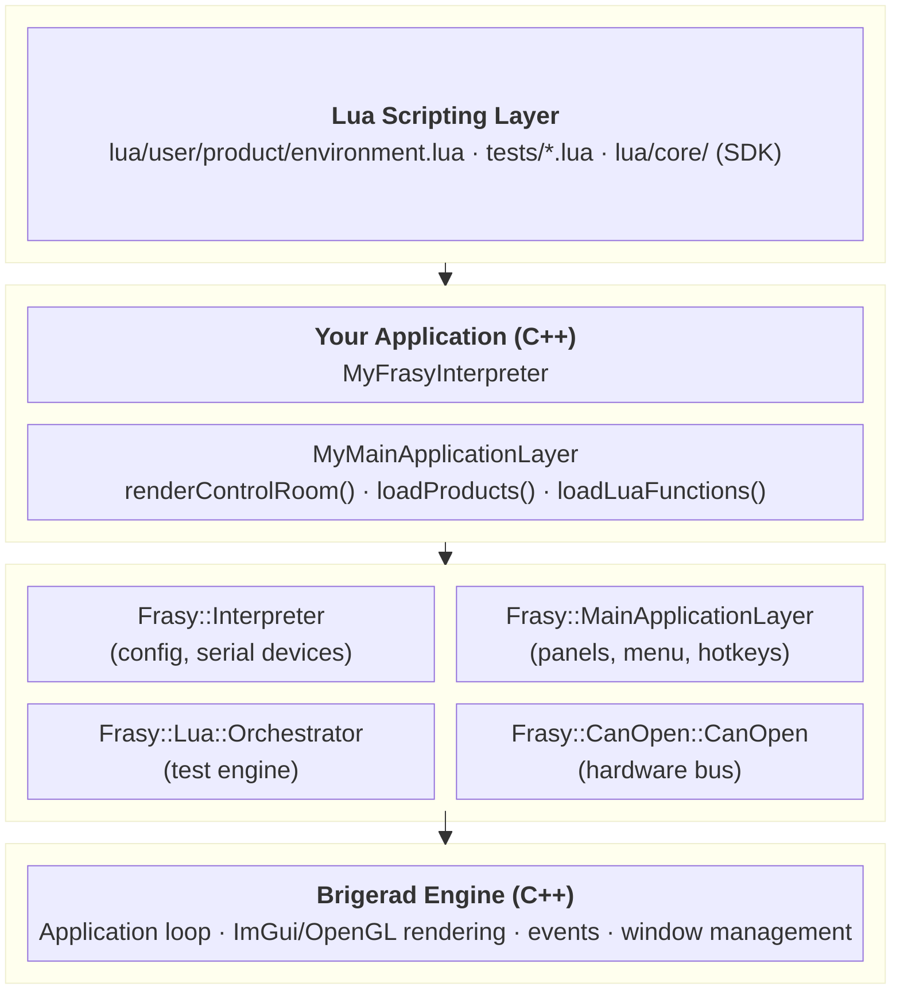
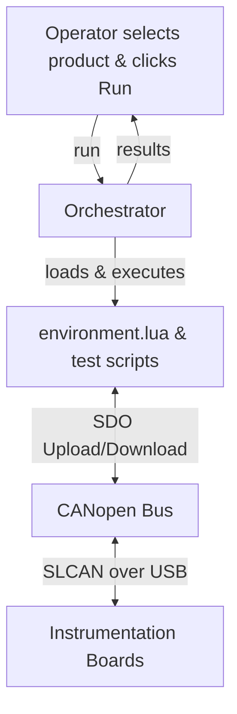

# Overview

Frasy is a Windows desktop application for automated PCBA (Printed Circuit Board Assembly) testing. It combines a **C++ host process** — responsible for the UI, hardware communication, and test orchestration — with a **Lua scripting layer** where all test logic lives. This split allows test engineers to write and iterate on test sequences without recompiling the application.

---

## High-Level Block Diagram



---

## Layer Responsibilities

### Lua Scripting Layer

Where test engineers work. Scripts are plain `.lua` files organized by product. The framework provides a rich SDK of globals (`Sequence`, `Test`, `Expect`, `Sync`, `Popup`, etc.) that the Lua files call to define and execute tests.

### Your Application

You write a thin subclass of the framework classes to define:

- The **application identity** (window title, initial config).
- The **operator-facing UI** (product selector, serial number input, run button).
- Any **custom Lua functions** exposed to test scripts.

### Frasy Framework

The bulk of the system:

| Component | Role |
|---|---|
| `Frasy::Interpreter` | Application singleton. Owns `config.json` and serial device enumeration. |
| `Frasy::MainApplicationLayer` | Base UI layer with built-in panels (log, results, CANopen viewer, etc.) and the menu bar. |
| `Frasy::Lua::Orchestrator` | Test engine. Manages generation, validation, and execution of Lua test scripts across multiple UUTs. |
| `Frasy::CanOpen::CanOpen` | Hardware communication. Drives CANopen over SLCAN to talk to instrumentation boards. |

### Brigerad Engine

A lightweight ImGui/OpenGL application framework providing:

- The main loop and window management.
- Event dispatch (keyboard, mouse, window resize).
- Layer stack architecture (`onAttach`, `onUpdate`, `onImGuiRender`, `onEvent`).
- Texture and rendering utilities.

Frasy applications do not interact with Brigerad directly — the Frasy framework wraps it.

---

## Data & Control Flow



1. The operator selects a product and presses **Run**.
2. The orchestrator loads Lua files, generates the execution plan (Solution), validates script integrity, then executes.
3. During execution, Lua test scripts communicate with hardware boards through the CANopen bus via SDO operations.
4. Results are collected, saved to disk, and displayed in the UI.

---

## File Layout

```
<project>/
  src/
    my_frasy_interpreter.cpp        ← application entry point
    layers/
      my_main_application_layer.*   ← operator UI and product loading
    lua/user/                       ← product test scripts
    config.json                     ← runtime configuration
  vendor/
    frasy/                          ← Frasy framework (git submodule)
      Frasy/src/                    ← C++ framework source
      Frasy/lua/core/               ← Lua SDK (globals, expectations, requirements)
      Brigerad/                     ← rendering/application engine
  CMakeLists.txt
```

---

## Key Design Decisions

- **C++/Lua split**: C++ handles performance-critical orchestration and hardware I/O; Lua provides a scriptable, hot-reloadable test authoring experience.
- **Submodule-based**: The framework lives in `vendor/frasy/` as a git submodule, cleanly separating framework code from application-specific code.
- **Template pattern**: Applications extend framework classes rather than modifying them, keeping upgrades simple.
- **Multi-UUT concurrency**: The orchestrator runs test sequences in parallel across multiple units under test, with synchronization primitives (`Sync()`, `Exclusive()`, `Once()`) built into the Lua SDK.

---

## Next Steps

- [C++ Layer](cpp-layer.md) — Interpreter, layers, panels, and override points
- [Lua Layer](lua-layer.md) — product structure, environment, sequences, and expectations
- [Hardware Communication](hardware.md) — CANopen, SLCAN, EDS, and SDO operations
- [Test Lifecycle](test-lifecycle.md) — generation, validation, execution, and the Solution model
