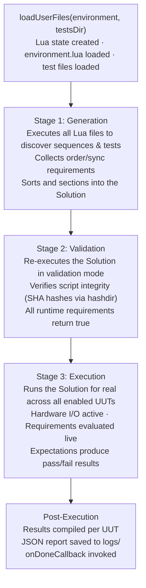
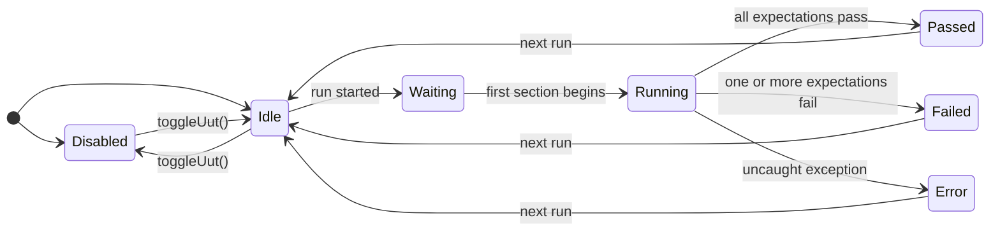
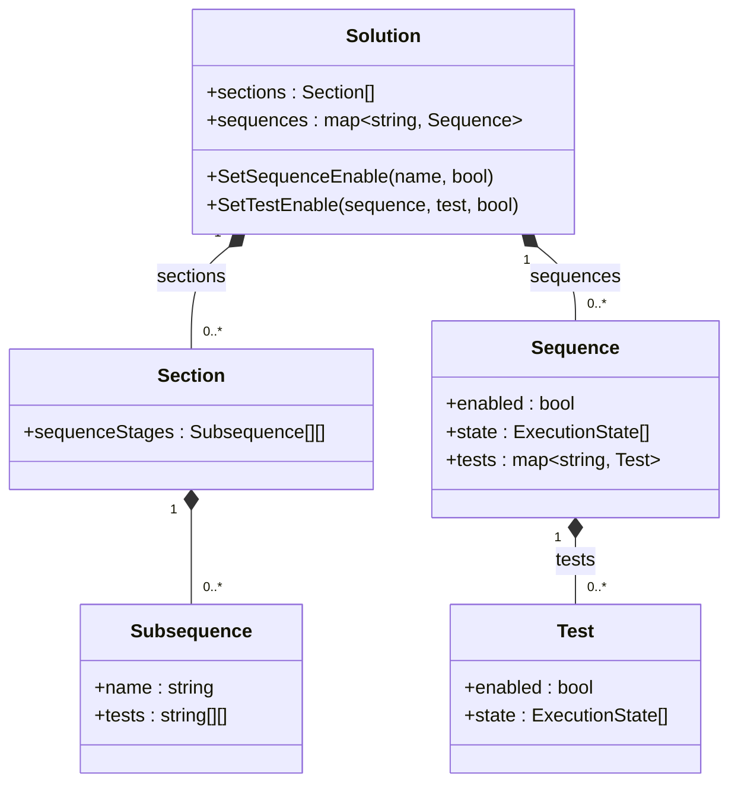
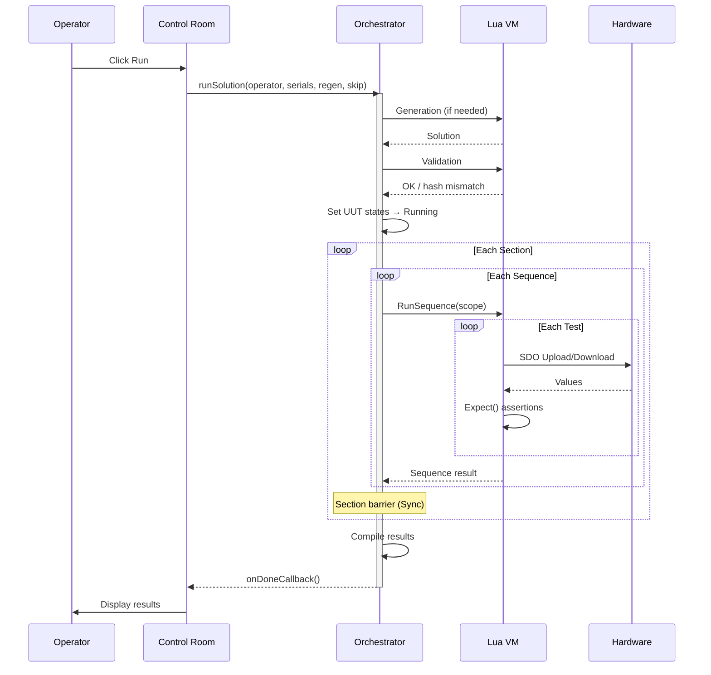

# Test Lifecycle

This page describes how Frasy transforms Lua source files into an executable test plan and runs it across one or more UUTs. The lifecycle has three stages: **generation**, **validation**, and **execution**.

---

## Stages Overview



The `Stage` enum tracks where the system is at any moment:

```lua
Stage = {
    idle       = 0,
    generation = 1,
    validation = 2,
    execution  = 3,
}
```

This is exposed to Lua as `Context.info.stage`, and many SDK functions behave differently based on the current stage (e.g., expectations always pass during generation/validation).

---

## Stage 1: Generation

**Goal**: Discover all sequences and tests, collect ordering constraints, and produce a sorted execution plan (the Solution).

### What Happens

1. A fresh `sol::state` (Lua VM) is created.
2. The core SDK is loaded (framework globals, expectations, requirements, etc.).
3. `environment.lua` is executed — this registers UUTs, IBs, and execution policy.
4. All test files in the product's `tests/` directory are executed.
5. Each `Sequence("name", fn)` call registers a sequence. Each `Test("name", fn)` call inside registers a test.
6. The sequence and test body functions are **called** — this collects `Requires()` calls to discover order requirements and sync points.
7. Expectations (`Expect()`) return immediately with `pass = true` during generation — no actual assertions are made.
8. All collected order requirements and sync points are processed by the sort algorithm.
9. The **Solution** is produced and optionally saved to `lua/solution.json`.

### Forward References

Order requirements can reference sequences or tests that haven't been defined yet at the point of declaration. The generation stage retries sequences that fail due to unresolved references, making forward references valid. If no progress can be made, a `GenerationError` is raised.

### The Sort Algorithm

The sorter:

1. Respects `ToBeFirst` / `ToBeLast` edge requirements.
2. Builds a dependency graph from `ToBeBefore` / `ToBeAfter` requirements.
3. Performs a topological sort on sequences and on tests within each sequence.
4. **Sectionizes** — splits the sorted list at sync points (`Sync()`) to create sections that act as barriers.

---

## Stage 2: Validation

**Goal**: Verify script integrity and catch errors before committing to a real test run.

### What Happens

1. Script file hashes are verified against the stored hash file (generated by `generate_hashes.bat`).
2. The Solution is re-executed in `Stage.validation` mode.
3. All runtime requirements (`ToPass()`, `ToFail()`, `ToBeComplete()`) return `true` unconditionally.
4. Expectations return `pass = true` unconditionally.
5. Hardware I/O calls (`Upload`/`Download`) are no-ops (guarded by `if stage ~= Stage.execution then return end`).

### Skipping Validation

In debug mode (or when `skipVerification` is passed to `runSolution()`), hash checking is bypassed. The validation stage still runs the Lua files but won't block on hash mismatches.

---

## Stage 3: Execution

**Goal**: Actually run the tests against real hardware and produce results.

### What Happens

1. Each enabled UUT gets its own Lua coroutine/thread context.
2. The orchestrator iterates through the Solution's sections sequentially.
3. Within each section, sequences execute according to the execution policy (parallel or sequential).
4. Within each sequence, tests run in their sorted order.
5. Runtime requirements are **evaluated for real** — if unmet, the scope is skipped.
6. Expectations perform actual assertions and record pass/fail.
7. Hardware I/O is active — SDO uploads/downloads communicate with physical boards.
8. `Sync()` blocks until all UUTs reach the barrier.
9. `Exclusive(id, fn)` serializes access across UUTs.
10. Results, timing, and expectation details are collected.

### Error Handling During Execution

| Error Type | Result |
|---|---|
| `UnmetRequirement` | Scope is **skipped** (not failed) |
| `UnmetExpectation` (from `:Mandatory()`) | Test immediately **fails** and stops |
| Any other Lua error | Test **fails** with the error message |
| Uncaught sequence-level error | Sequence **fails**; remaining tests in it are not run |

---

## UUT States

Each Unit Under Test progresses through a state machine during execution:



| State | Meaning |
|---|---|
| **Disabled** | UUT is excluded from the run (toggled via `toggleUut()`) |
| **Idle** | Ready, not yet started |
| **Waiting** | Waiting at a synchronization barrier (`Sync()`) |
| **Running** | Actively executing tests |
| **Passed** | All sequences and tests passed |
| **Failed** | One or more expectations did not pass |
| **Error** | An unrecoverable error occurred (Lua crash, hardware timeout, etc.) |

The state is queryable via:

```cpp
m_orchestrator.getUutState(uutIndex);  // returns Frasy::UutState enum
```

---

## The Solution Model

The Solution is the **execution plan** — the fully sorted, sectioned, dependency-resolved map of everything that needs to run.



### Structure Breakdown

- **Solution** — top-level container. Holds the ordered sections and a flat map of all sequences (for enable/disable and state tracking).
- **Section** — a group of sequences separated by sync barriers. All UUTs must complete a section before moving to the next.
- **Subsequence** — a reference to a sequence within a section, plus its test execution order (also potentially sectioned by test-level sync points).
- **Sequence** — metadata about a sequence: enabled state and per-UUT execution states.
- **Test** — metadata about a test: enabled state and per-UUT execution states.

### ExecutionState

Each sequence and test tracks a per-UUT execution state:

```cpp
enum ExecutionState {
    idle,       // Not yet reached
    disabled,   // Excluded from run
    waiting,    // At a sync barrier
    running,    // Currently executing
    passed,     // Completed successfully
    failed,     // One or more expectations failed
    error,      // Uncaught exception
};
```

### Enabling/Disabling at Runtime

The Test Viewer panel (++f6++) allows operators to enable or disable individual sequences and tests before or between runs:

```cpp
m_orchestrator.setSequenceEnable("Power On", false);
m_orchestrator.setTestEnable("Power On", "Check Voltage", false);
```

Disabled items are skipped during execution with reason "Disabled".

---

## Results and Reporting

After execution completes for each UUT, the orchestrator:

1. Compiles a **report** containing:
    - Metadata: versions, operator, serial, date, overall pass/fail, timing.
    - IB info: each board's software/hardware version and serial.
    - Per-sequence results with timing.
    - Per-test results with timing and all expectation details.

2. Invokes `Context.map.onReport(report)` — a user-defined hook to transform the report.

3. Saves the report as JSON to:
    - `logs/last/` — always overwritten.
    - `logs/pass/` or `logs/fail/` — organized by outcome.

4. Invokes the C++ `onDoneCallback` to signal the UI.

### Report Structure (JSON)

```json
{
  "info": {
    "version": { "frasy": "...", "orchestrator": "1.2.0", "scripts": "1.0.0", "application": "..." },
    "title": "MyProduct",
    "operator": "John",
    "serial": "SN123456789",
    "uut": 1,
    "date": "2024-05-15 14:30:00",
    "pass": true,
    "time": { "start": 0.0, "stop": 2.5, "elapsed": 2.5, "process": 2.1 }
  },
  "ib": {
    "MyBoard": { "kind": 0, "nodeId": 10, "software": "1.2.0", "hardware": "2.0.0", "serial": "12345" }
  },
  "sequences": {
    "Power On": {
      "pass": true,
      "time": { "start": 0.0, "stop": 1.2, "elapsed": 1.2, "process": 1.1 },
      "tests": {
        "Check Voltage": {
          "pass": true,
          "time": { "start": 0.0, "stop": 0.5, "elapsed": 0.5, "process": 0.5 },
          "expectations": [
            { "name": "Supply Voltage", "method": "ToBeInRange", "value": 5.02, "min": 4.9, "max": 5.1, "pass": true }
          ]
        }
      }
    }
  }
}
```

---

## Regeneration

The orchestrator caches the generated Solution in `lua/solution.json`. On subsequent runs:

- If `regenerate = false` and no source files have changed, the cached Solution is reused.
- If source files have been modified (detected by file modification timestamps), the Solution is regenerated automatically.
- `regenerate = true` forces regeneration regardless.

This speeds up repeated runs during testing.

---

## Sequence Diagram: Full Run


