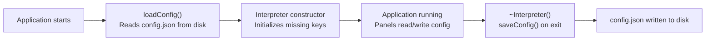

# Configuration

Frasy uses a single `config.json` file for runtime configuration. It stores framework settings
(log window, USB communication), UI state (window maximized, last product), and any
application-specific data you add. The file is loaded at startup and saved on exit.

---

## File Location

`config.json` lives in the same directory as the executable at runtime. During development, you
provide a source copy at `src/config.json` which is synced to the output directory by CMake's
`refresh_config` target on every build.

```
src/
  config.json          ← your source copy (checked into git)

build/bin/MyApp_v1.0.0/
  config.json          ← runtime copy (auto-synced from src/)
```

!!! warning
    Changes made at runtime (by the application or through the UI) are written to the **runtime
    copy** in the output directory, not back to `src/config.json`. If you rebuild and the source
    copy is newer, it will overwrite runtime changes. During active development, edit
    `src/config.json` for persistent defaults.

---

## Default Structure

A minimal `config.json`:

```json
{
  "LogWindow": {
    "AutoScroll": true,
    "CombineLoggers": true,
    "EntriesToShow": 4096,
    "ShowLevels": [true, true, true, true, true, true, true],
    "Loggers": {},
    "ShowLogSource": true,
    "ShowSourceLocation": true,
    "ShowTimeStamp": true,
    "SourceLocationRenderStyle": 4
  },
  "communication": {
    "usbWhitelist": [
      { "vid": 1155, "pid": 42180, "mi": 0 }
    ]
  }
}
```

---

## Built-In Keys

### `LogWindow`

Controls the Log Window panel (F2) display behavior.

| Key | Type | Default | Description |
|---|---|---|---|
| `AutoScroll` | bool | `true` | Automatically scroll to the latest log entry |
| `CombineLoggers` | bool | `true` | Show all loggers in a single view |
| `EntriesToShow` | int | `4096` | Maximum number of log entries to keep in memory |
| `ShowLevels` | bool[7] | all `true` | Visibility per spdlog level (trace, debug, info, warn, error, critical, off) |
| `Loggers` | object | `{}` | Per-logger level overrides (e.g., `{"SlCan": 2}` sets SlCan to info) |
| `ShowLogSource` | bool | `true` | Display the logger name column |
| `ShowSourceLocation` | bool | `true` | Display file/line of the log call |
| `ShowTimeStamp` | bool | `true` | Display timestamp column |
| `SourceLocationRenderStyle` | int | `4` | How to render source location (file, line, function, or combinations) |

These settings are also editable from the Log Window panel's options menu at runtime. Changes
are persisted automatically.

### `communication`

Configures hardware detection for the SLCAN USB adapter.

| Key | Type | Description |
|---|---|---|
| `usbWhitelist` | array | List of USB device identifiers to match |
| `usbWhitelist[].vid` | int | USB Vendor ID |
| `usbWhitelist[].pid` | int | USB Product ID |
| `usbWhitelist[].mi` | int (optional) | USB Interface Number |
| `usbWhitelist[].rev` | int (optional) | USB Revision |

The default whitelist entry (`vid: 1155`, `pid: 42180`, `mi: 0`) matches SMarTest devices
(DAQ, PIO, R8L). If your SLCAN adapter has different USB identifiers, add them here.

```json
"communication": {
    "usbWhitelist": [
        { "vid": 1155, "pid": 42180, "mi": 0 },
        { "vid": 1234, "pid": 5678 }
    ]
}
```

### `maximized`

| Key | Type | Default | Description |
|---|---|---|---|
| `maximized` | bool | `true` | Whether the window starts maximized |

Set automatically when the user maximizes or restores the window.

### `UserConfigPath`

| Key | Type | Default | Description |
|---|---|---|---|
| `UserConfigPath` | string | `"usr_config.json"` | Path to an optional user-specific config file |

This key is available for applications that want to layer a user-specific config on top of the
base config (e.g., per-operator preferences). The framework reads it but does not use it
internally — it's up to your application to load and interpret it.

---

## Application-Specific Keys

You can add arbitrary keys to `config.json` for your own application's needs. The framework
ignores keys it doesn't recognize.

### Initializing Custom Keys

In your `Interpreter` subclass constructor, ensure your keys exist with sensible defaults:

```cpp
class MyFrasyInterpreter : public Frasy::Interpreter {
public:
    MyFrasyInterpreter() : Interpreter("My App")
    {
        // Initialize product-specific config if not present
        if (m_config["MyApp"].empty()) {
            m_config["MyApp"] = {
                {"defaultOperator", ""},
                {"stressTestRepeat", 10},
                {"autoOpenResults", true}
            };
        }
        pushLayer(new MyMainApplicationLayer());
    }
};
```

### Reading Values

```cpp
// Read with a default fallback
auto repeat = Frasy::Interpreter::Get().getConfig().value("stressTestRepeat", 10);

// Read nested values
auto& cfg = Frasy::Interpreter::Get().getConfig();
std::string op = cfg["MyApp"].value("defaultOperator", "");
```

### Writing Values

```cpp
auto& cfg = Frasy::Interpreter::Get().getConfig();
cfg["LastProduct"] = m_activeProduct;

// Persist immediately (otherwise saved on exit)
Frasy::Interpreter::Get().saveConfig();
```

### Common Application Keys

Here are keys commonly added by applications:

| Key | Purpose |
|---|---|
| `LastProduct` | Remember the last-selected product across sessions |
| `LastOperator` | Pre-fill the operator name field |
| `FixtureId` | Identify which physical fixture this station is |
| `ReportPath` | Custom output directory for test reports |
| `DebugMode` | Enable/disable debug features |

---

## Lifecycle



1. **Load** — `config.json` is read from disk when the `Interpreter` is constructed. If the
   file doesn't exist or is malformed, an empty JSON object is used.
2. **Initialize** — Your subclass constructor can add default keys for missing entries.
3. **Runtime** — Any code can read/write via `Frasy::Interpreter::Get().getConfig()`. Built-in
   panels persist their state automatically (e.g., Log Window saves its options on close).
4. **Save** — The destructor calls `saveConfig()`, writing the current state to disk. You can
   also call `saveConfig()` explicitly at any time for immediate persistence.

---

## Tips

- **Keep `src/config.json` minimal.** Only include settings that differ from framework defaults
  or that you want all developers/stations to share. Runtime state (like `LastProduct` or
  `maximized`) will be added automatically at runtime.
- **Use `value()` with defaults.** Always read config entries with `cfg.value("key", default)`
  instead of `cfg["key"]` to gracefully handle missing keys.
- **Don't store secrets.** `config.json` is a plain text file shipped alongside the
  application. Don't put API keys, passwords, or other sensitive data in it.
- **Version your schema.** If your application evolves and config keys change meaning, consider
  adding a version key (e.g., `"configVersion": 2`) and migrating old formats on load.
- **The config is a JSON object.** The top level must be a JSON object (`{}`). If it's anything
  else (or unparseable), the framework replaces it with an empty object at startup.
