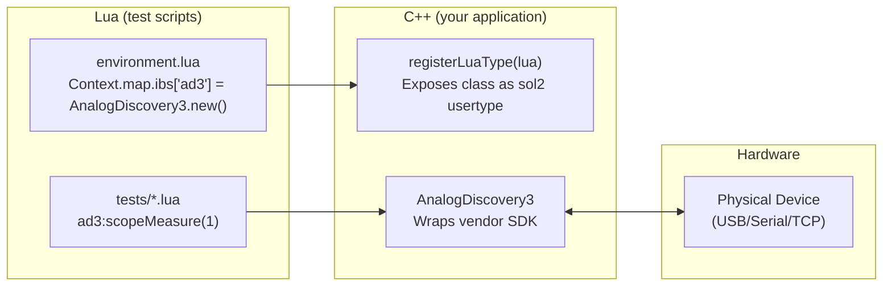

# Custom Instrumentation Boards

Frasy ships with predefined board types for SMarTest hardware (`DAQ`, `PIO`, `R8L`). When your
fixture uses different hardware — whether it's a CANopen device with a different object
dictionary, or a non-CANopen instrument like an oscilloscope or bench power supply — you need
to define a custom board type.

There are two approaches depending on your hardware's communication protocol:

| Approach | When to Use | Defined In | Communication |
|---|---|---|---|
| **CANopen board (Lua)** | Your board speaks CANopen and has an EDS file | Lua (`lua/core/cep/` or `lua/user/`) | SDO via `Ib:Upload()` / `Ib:Download()` |
| **Non-CANopen device (C++)** | Your device uses USB, serial, TCP, or a vendor SDK | C++ with sol2 usertype | Direct API calls |

---

## CANopen Boards (Lua)

If your custom hardware is a CANopen node with an EDS file, you implement it entirely in Lua
by building on the `Ib` base class — the same pattern used by `DAQ`, `PIO`, and `R8L`.

### Structure

A CANopen board definition consists of:

1. An **EDS file** describing the node's object dictionary
2. A **Lua module** that creates the board class with high-level methods

### Step 1: Provide an EDS File

Place your board's EDS file in your project. Convention is to put it alongside your board
definition:

```
src/lua/user/common/boards/
  my_board.lua
  my_board.eds
```

### Step 2: Define the Board Class

```lua
-- src/lua/user/common/boards/my_board.lua
local Ib = require("lua/core/sdk/environment/ib")
local CheckField = require("lua/core/utils/check_field")

---@class MyBoard
---@field ib Ib
MyBoard = {}
MyBoard.__index = MyBoard

---@class MyBoard_NewOpt
---@field name string?    -- default: "my_board"
---@field nodeId integer? -- default: 10

---@param opt MyBoard_NewOpt?
---@return MyBoard
function MyBoard:New(opt)
    local ib = Ib:New()
    ib.kind = 99  -- Arbitrary kind ID for your board

    if opt == nil then opt = {} end
    CheckField(opt, "opt", type(opt) == "table")
    if opt.name == nil then opt.name = "my_board" end
    if opt.nodeId == nil then opt.nodeId = 10 end

    ib.name = opt.name
    ib.nodeId = opt.nodeId
    ib.eds = "lua/user/common/boards/my_board.eds"

    return setmetatable({ ib = ib }, MyBoard)
end
```

### Step 3: Add High-Level Methods

Wrap `Ib:Upload()` and `Ib:Download()` calls in descriptive methods that test engineers will
use:

```lua
--- Read the temperature sensor value.
---@return number temperature in °C
function MyBoard:ReadTemperature()
    return self.ib:Upload(self.ib.od["Temperature Sensor"]["Value"])
end

--- Set the output voltage.
---@param volts number desired voltage
function MyBoard:SetVoltage(volts)
    local od = self.ib.od["Output Voltage"]["Desired"]
    CheckField(volts, "voltage", type(volts) == "number")
    self.ib:Download(od, volts)
end

--- Read the measured output current.
---@return number current in amps
function MyBoard:ReadCurrent()
    return self.ib:Upload(self.ib.od["Output Current"]["Measured"])
end

--- Reset the board to factory defaults.
function MyBoard:Reset()
    self.ib:Reset()
end
```

### Step 4: Register in the Environment

```lua
-- environment.lua
require("lua/user/common/boards/my_board")

Environment.Make(function()
    Environment.ScriptVersion("1.0.0")
    Environment.Uut.Count(1)
    Environment.Ib.Add(MyBoard:New({ name = "heater", nodeId = 10 }))
end)
```

### Step 5: Use in Tests

```lua
Test("Temperature Reading", function()
    local board = Context.map.ibs.heater --[[@as MyBoard]]
    board:SetVoltage(5.0)
    SleepFor(1000)
    local temp = board:ReadTemperature()
    Expect(temp, "Board Temperature"):ToBeLesser(85.0)
end)
```

### How It Works

When `Environment.Ib.Add()` is called with your board:

1. The framework reads the EDS file at the path in `ib.eds`.
2. It parses the object dictionary and attaches it as `board.ib.od`.
3. During execution, `Ib:Upload()` and `Ib:Download()` perform SDO operations via the CANopen
   bus.
4. During generation/validation, they return default values without touching hardware.

You get stage-aware behavior for free — no need to guard your methods manually.

### Tips for CANopen Boards

- **Name OD entries clearly** in your EDS file — those names become the keys in `self.ib.od`.
- **Add parameter validation** using `CheckField` to catch mistakes early.
- **Provide enums** for constants (e.g., channel IDs, modes) as class-level tables.
- **Add caching** if you read the same OD entry repeatedly — store it locally and only refresh
  when needed.

---

## Non-CANopen Devices (C++)

For instruments that don't speak CANopen — bench multimeters, oscilloscopes, power supplies,
GPIO expanders over USB, or anything with a vendor SDK — you define the board as a C++ class
and expose it to Lua as a sol2 usertype.

### Architecture



### Step 1: Define the C++ Class

Your class needs:

- A `static void registerLuaType(sol::state_view lua)` method
- An `m_ibInfo` member (for framework compatibility and test reports)
- Methods that wrap the vendor SDK

```cpp
// src/services/my_instrument.h
#pragma once

#include "utils/lua/ib_info.h"
#include <sol/sol.hpp>

namespace Frasy {

class MyInstrument {
public:
    static void registerLuaType(sol::state_view lua);

    MyInstrument();
    ~MyInstrument() noexcept;

    bool   open(const std::string& port);
    bool   close() noexcept;
    bool   isOpen() const noexcept;
    double measure(int channel);
    void   setOutput(int channel, double value);

private:
    static constexpr const char* s_tag = "MyInstrument";

    Lua::IbInfo m_ibInfo;
    // ... vendor SDK handles, serial port, etc.
};

}  // namespace Frasy
```

### Step 2: Register the Lua Usertype

The key pattern: register **real implementations** during execution and **no-ops** during
generation/validation. This mirrors how the framework's built-in CANopen operations are
stage-guarded.

```cpp
// src/services/my_instrument.cpp
#include "my_instrument.h"

namespace Frasy {

void MyInstrument::registerLuaType(sol::state_view lua)
{
    // Register the IbInfo type if not already done
    Lua::IbInfo::registerLuaType(lua);

    sol::usertype<MyInstrument> udt = lua.new_usertype<MyInstrument>(
        "MyInstrument",
        sol::meta_function::construct,
        sol::factories([] { return std::make_shared<MyInstrument>(); })
    );

    // The `ib` field makes this compatible with Frasy's IB reporting system
    udt["ib"] = sol::readonly(&MyInstrument::m_ibInfo);

    // Stage-aware registration
    if (lua["Context"]["info"]["stage"].get<int>() == lua["Stage"]["execution"].get<int>()) {
        // Real implementations — only during execution
        udt["open"]      = &MyInstrument::open;
        udt["close"]     = &MyInstrument::close;
        udt["isOpen"]    = &MyInstrument::isOpen;
        udt["measure"]   = &MyInstrument::measure;
        udt["setOutput"] = &MyInstrument::setOutput;
    }
    else {
        // No-ops during generation/validation
        udt["open"]      = [](MyInstrument&, const std::string&) { return true; };
        udt["close"]     = [](MyInstrument&) { return true; };
        udt["isOpen"]    = [](MyInstrument&) { return true; };
        udt["measure"]   = [](MyInstrument&, int) { return 0.0; };
        udt["setOutput"] = [](MyInstrument&, int, double) {};
    }
}

}  // namespace Frasy
```

### Step 3: Register in loadUserFunctions (or loadUserValues)

Call `registerLuaType` from your layer's callback so the type is available when
`environment.lua` runs:

```cpp
void MyMainApplicationLayer::loadLuaFunctions(sol::state_view lua)
{
    Frasy::MyInstrument::registerLuaType(lua);
}
```

!!! note
    Registration must happen **before** the environment is loaded. Both
    `setLoadUserFunctions` and `setLoadUserValues` are called at the right time — the type
    will be available when `environment.lua` executes.

### Step 4: Instantiate in environment.lua

Since the usertype exposes a constructor, test engineers can create instances directly in Lua
and add them to `Context.map.ibs`:

```lua
-- environment.lua
Environment.Make(function()
    Environment.ScriptVersion("1.0.0")
    Environment.Uut.Count(1)

    -- CANopen boards use Environment.Ib.Add()
    Environment.Ib.Add(DAQ:New({ name = "daq", nodeId = 2 }))

    -- Non-CANopen devices are added directly to Context.map.ibs
    Context.map.ibs["instrument"] = MyInstrument.new()
end)
```

### Step 5: Use in Tests

```lua
Test("Output Voltage", function()
    local inst = Context.map.ibs.instrument --[[@as MyInstrument]]
    inst:open("COM3")
    inst:setOutput(1, 5.0)
    SleepFor(200)
    local v = inst:measure(1)
    Expect(v, "Output"):ToBeInPercentage(5.0, 2.0)
    inst:close()
end)
```

### The `ib` Field and IbInfo

The `ib` field is what makes your custom device show up in test reports alongside CANopen
boards. The framework reads `ib.name`, `ib.serialNumber`, `ib.softwareVersion`, and
`ib.hardwareVersion` when generating reports.

```cpp
MyInstrument::MyInstrument()
    : m_ibInfo{.kind = 0, .edsPath = "N/A"}
{
}

bool MyInstrument::open(const std::string& port)
{
    // ... open the device ...

    // Populate IbInfo for reports
    m_ibInfo.name            = "My Instrument";
    m_ibInfo.nodeId          = 0;
    m_ibInfo.serialNumber    = querySerial();
    m_ibInfo.softwareVersion = queryFirmwareVersion();
    m_ibInfo.hardwareVersion = queryModelNumber();

    return true;
}
```

### Exposing Enums and Constants

For devices with multiple modes, channels, or filter types, expose them as nested tables on
the usertype:

```cpp
void MyInstrument::registerLuaType(sol::state_view lua)
{
    // ... usertype registration ...

    // Expose enums as nested tables
    udt["Mode"] = lua.create_table_with(
        "DC",      0,
        "AC",      1,
        "ACplusDC", 2
    );

    udt["Range"] = lua.create_table_with(
        "Auto",   0,
        "R100mV", 1,
        "R1V",    2,
        "R10V",   3,
        "R100V",  4
    );
}
```

In Lua:

```lua
inst:setMode(MyInstrument.Mode.AC)
inst:setRange(MyInstrument.Range.R10V)
```

---

## Comparison: `Environment.Ib.Add()` vs. `Context.map.ibs`

| | `Environment.Ib.Add(board)` | `Context.map.ibs["name"] = board` |
|---|---|---|
| **Communication** | CANopen (SDO via SLCAN) | Anything (USB, serial, TCP, vendor SDK) |
| **EDS file** | Required — parsed automatically | Not applicable |
| **Object dictionary** | Built from EDS, accessible as `board.ib.od` | N/A (methods wrap hardware directly) |
| **Stage guards** | Built into `Ib:Upload()` / `Ib:Download()` | You implement them in `registerLuaType` |
| **CANopen node management** | Automatic (added to bus, heartbeat, NMT) | N/A |
| **Test report integration** | Automatic via `ib` field | Works if your type exposes an `ib` field with `IbInfo` |
| **Defined in** | Lua | C++ (usertype) + Lua (instantiation) |

---

## Tips

- **Always expose an `ib` field.** Even for non-CANopen devices, this ensures your instrument
  appears in test reports with its serial number and firmware version. Use the `IbInfo` struct.
- **Stage-guard all hardware I/O.** During generation and validation, the orchestrator runs
  your test code to discover sequences and requirements — real hardware calls would fail or
  cause damage. Always provide no-op implementations for non-execution stages.
- **Open/close in tests, not in the environment.** Instantiate the object in `environment.lua`,
  but defer `open()` calls to the test code (which only runs during execution). This keeps
  generation and validation fast and hardware-independent.
- **Provide enums, not magic numbers.** Test scripts should read like documentation. Prefer
  `inst:setMode(MyInstrument.Mode.AC)` over `inst:setMode(1)`.
- **Keep the Lua API high-level.** Wrap low-level protocol details inside your C++ class.
  Test engineers should call `inst:measureVoltage(channel)`, not fiddle with register addresses.
- **Handle errors gracefully.** Throw `sol::error` with descriptive messages so that failures
  surface clearly in the test report.
