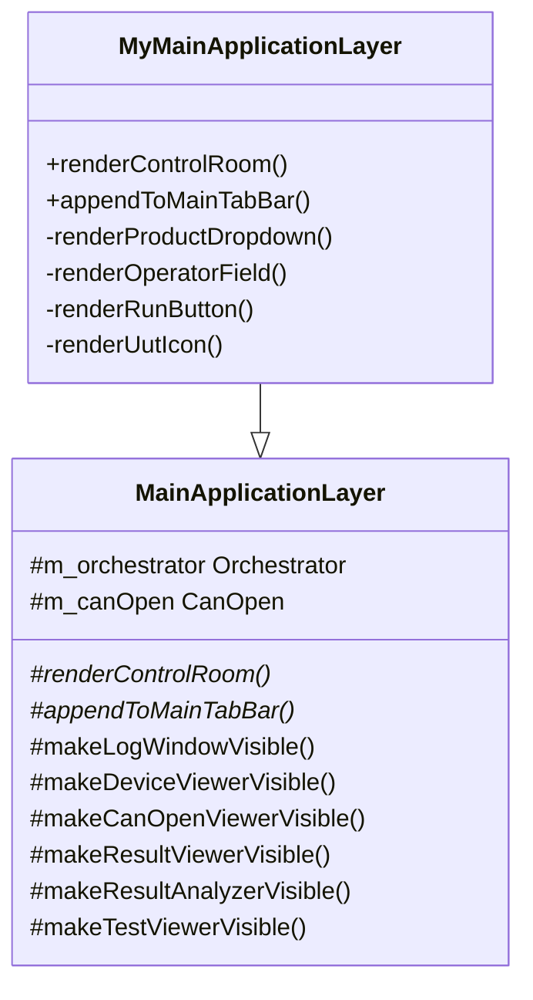

# Customizing the UI

Frasy's UI is built with [Dear ImGui](https://github.com/ocornut/imgui) (immediate mode). The
framework provides the menu bar, built-in panels, and a window called the **Control Room** where
your operator-facing interface lives. You customize it by overriding virtual methods in your
`MainApplicationLayer` subclass.

---

## Architecture Recap



The framework handles:

- The main menu bar (File, View, ?)
- Panel lifecycle and hotkey toggling (F2–F8)
- Window docking and lock/unlock behavior
- Popup rendering for Lua `Popup()` calls

You handle:

- The Control Room contents (product selector, operator inputs, run button, UUT status)
- Any extra menu items
- Any application-specific logic tied to UI actions

---

## The Control Room

`renderControlRoom()` is the primary override point. It is called every frame inside the
Control Room ImGui window. The window is already created for you with standard positioning —
you just render your widgets inside it.

### Minimal Example

```cpp
void MyMainApplicationLayer::renderControlRoom()
{
    ImGui::Text("Hello, Frasy!");

    if (ImGui::Button("Run") && !m_orchestrator.isRunning()) {
        m_orchestrator.runSolution("Operator", {"SN001"}, false, false, [this] {
            // Called when the test run finishes
        });
    }
}
```

### Typical Control Room Structure

A realistic Control Room includes:

1. **Product selector** — dropdown to choose which product to test
2. **Operator name** — text input for traceability
3. **Serial number(s)** — one per UUT
4. **Run button** — launches the test sequence
5. **UUT status icons** — show idle/running/pass/fail per UUT

Here's a condensed example from the template:

```cpp
void MyMainApplicationLayer::renderControlRoom()
{
    if (!ImGui::Begin("ControlRoom", nullptr, m_imGuiWindowFlags)) {
        ImGui::End();
        return;
    }

    // Product dropdown
    ImGui::Text("Product");
    ImGui::SameLine(s_labelWidth);
    ImGui::SetNextItemWidth(s_inputWidth);
    if (ImGui::BeginCombo("##Product", m_activeProduct.c_str())) {
        for (auto& [env, testPath, name, modified] : m_products) {
            if (ImGui::Selectable(name.c_str(), name == m_activeProduct)) {
                makeOrchestrator(name, env, testPath);
            }
        }
        ImGui::EndCombo();
    }

    // Operator name
    ImGui::Text("Operator");
    ImGui::SameLine(s_labelWidth);
    ImGui::SetNextItemWidth(s_inputWidth);
    ImGui::InputText("##Operator", m_operatorName.data(), m_operatorName.size());

    // Serial number
    ImGui::Text("Serial Number");
    ImGui::SameLine(s_labelWidth);
    ImGui::SetNextItemWidth(s_inputWidth);
    ImGui::InputText("##Serial", m_serialNumber.data(), m_serialNumber.size());

    // Run button
    renderRunButton();
    ImGui::SameLine();
    renderUutIcon();

    ImGui::End();
}
```

---

## Adding Menu Items

Override `appendToMainTabBar()` to inject custom menus into the main menu bar. Your menus
appear between the built-in **View** and **?** menus.

```cpp
void MyMainApplicationLayer::appendToMainTabBar()
{
    if (ImGui::BeginMenu("Tools")) {
        if (ImGui::MenuItem("Calibrate DAQ")) {
            // Launch calibration routine
        }
        if (ImGui::MenuItem("Export Results")) {
            // Custom export logic
        }
        ImGui::EndMenu();
    }
}
```

---

## Accessing the Orchestrator

The orchestrator (`m_orchestrator`) is a protected member available in your subclass. Common
operations:

```cpp
// Load a product's Lua files
m_orchestrator.loadUserFiles(environmentPath, testsDir);

// Start a test run
m_orchestrator.runSolution(
    operatorName,          // std::string
    serialNumbers,         // std::vector<std::string> — one per UUT
    regenerate,            // bool — force re-generation of the Solution
    skipVerification,      // bool — skip hash verification (debug only)
    [this] { onDone(); }   // callback when run finishes
);

// Query state
m_orchestrator.isRunning();
m_orchestrator.getUutState(uutIndex);  // returns Frasy::UutState enum
m_orchestrator.getMap();               // returns {ibs, uuts, teams}
m_orchestrator.getSolution();          // the current Solution model

// Inject custom Lua functions
m_orchestrator.setLoadUserFunctions([](sol::state_view lua) {
    lua["MyFunc"] = []() { return 42; };
});
```

---

## UUT State and Status Icons

The framework provides pre-loaded textures for UUT status indicators:

| Member | State |
|---|---|
| `m_idle` | UUT is idle, ready to run |
| `m_disabled` | UUT is disabled (excluded from run) |
| `m_waiting` | UUT is waiting at a sync barrier |
| `m_testing` | UUT is actively running tests |
| `m_pass` | UUT passed all tests |
| `m_fail` | UUT failed one or more tests |
| `m_error` | UUT encountered an unrecoverable error |
| `m_run` | Run button normal state |
| `m_runWarn` | Run button when verification is skipped |
| `m_abort` | Emergency stop icon |

Render them with `ImGui::Image` or `ImGui::ImageButton`:

```cpp
void MyMainApplicationLayer::renderUutIcon(std::size_t uut) const
{
    uint64_t texture;
    switch (m_orchestrator.getUutState(uut)) {
        case Frasy::UutState::Idle:     texture = m_idle->getRenderId(); break;
        case Frasy::UutState::Running:  texture = m_testing->getRenderId(); break;
        case Frasy::UutState::Passed:   texture = m_pass->getRenderId(); break;
        case Frasy::UutState::Failed:   texture = m_fail->getRenderId(); break;
        case Frasy::UutState::Error:    texture = m_error->getRenderId(); break;
        case Frasy::UutState::Disabled: texture = m_disabled->getRenderId(); break;
        case Frasy::UutState::Waiting:  texture = m_waiting->getRenderId(); break;
    }
    ImGui::Image(reinterpret_cast<void*>(texture), ImVec2{100.0f, 100.0f});
}
```

---

## Showing Built-In Panels Programmatically

You can open any built-in panel from code (e.g., after a test fails, auto-open the result
viewer):

```cpp
makeLogWindowVisible();         // Log Window (F2)
makeDeviceViewerVisible();      // Device Viewer (F3)
makeResultViewerVisible();      // Result Viewer (F4)
makeResultAnalyzerVisible();    // Result Analyzer (F5)
makeTestViewerVisible();        // Test Viewer (F6)
makeCanOpenViewerVisible();     // CANopen Viewer (F7)
```

A common pattern is to auto-open the result viewer when a test run fails:

```cpp
void MyMainApplicationLayer::onDone()
{
    for (const auto& uut : m_orchestrator.getMap().uuts) {
        if (m_orchestrator.getUutState(uut) == Frasy::UutState::Failed) {
            makeResultViewerVisible();
            break;
        }
    }
}
```

---

## Handling Hotkeys

The framework handles F2–F8 for panel toggling. You can add custom hotkeys in your
`onUpdate()` override:

```cpp
void MyMainApplicationLayer::onUpdate(Brigerad::Timestep ts)
{
    MainApplicationLayer::onUpdate(ts);  // Always call the base!

    if (Brigerad::Input::isKeyPressed(Brigerad::KeyCode::F9)) {
        loadProducts();  // Reload product list
    }
    if (Brigerad::Input::isKeyPressed(Brigerad::KeyCode::F10)) {
        m_skipVerification = !m_skipVerification;  // Toggle debug mode
    }
}
```

!!! warning
    Always call `MainApplicationLayer::onUpdate(ts)` first so that the built-in hotkeys and
    panel update logic still run.

---

## Window Locking

The framework provides a lock/unlock toggle in the View menu. When locked (`m_noMove = true`),
the Control Room window is pinned to the main viewport and cannot be dragged. This is the
default for production use. During development, unlocking lets you rearrange panels freely.

You can read or set `m_noMove` in your subclass if you need to programmatically control this.

---

## Lifecycle Hooks

If you need to perform setup when the layer attaches (e.g., loading products, setting default
field values), override `onAttach()`:

```cpp
void MyMainApplicationLayer::onAttach()
{
    MainApplicationLayer::onAttach();  // Always call the base!

    loadProducts();

    // Pre-fill operator name for development
    std::ranges::copy(std::string_view("Dev\0"), m_operatorName.begin());
}
```

If you need to clean up resources when the layer is removed (e.g., stopping background threads,
releasing hardware handles), override `onDetach()`:

```cpp
void MyMainApplicationLayer::onDetach()
{
    // Clean up your resources first
    m_canOpen.stop();

    MainApplicationLayer::onDetach();  // Then call the base
}
```

---

## Tips

- **Keep it simple for operators.** The Control Room should have the minimum number of inputs
  needed to start a test. Hide developer tools behind menus or hotkeys.
- **Use `ImGui::IsItemClicked(ImGuiMouseButton_Right)`** to add context menus (e.g., right-click
  the run button for stress-test options).
- **Store UI state in config.** Use `Frasy::Interpreter::Get().getConfig()` to persist settings
  like the last selected product across sessions.
- **All rendering is immediate-mode.** There's no retained widget tree — just call ImGui
  functions every frame. If a condition is false, simply don't render the widget.
