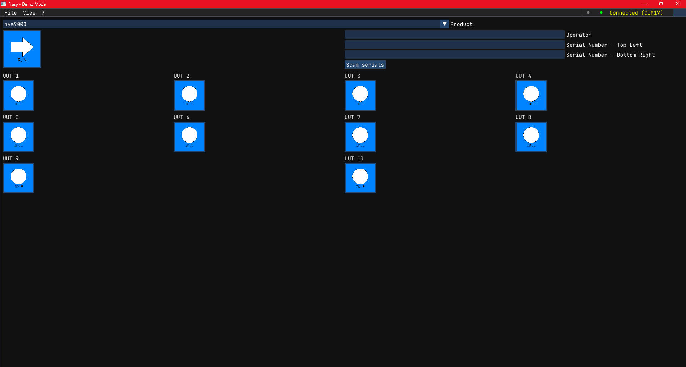

# Frasy

**Frasy** is a Windows desktop application for automated PCBA (Printed Circuit Board Assembly)
testing. It combines a C++ host process for UI, hardware communication, and test orchestration
with a Lua scripting layer where all test logic lives — allowing test engineers to write and
iterate on test sequences without recompiling the application.



## Quick Example

```lua
Sequence("Power On", function()
    Test("Check Supply Voltage", function()
        local daq = Context.map.ibs.daq --[[@as DAQ]]
        local v = daq:MeasureVoltage(Context.values.route._24VDC) -- Reads the voltage on a testpoint
        Expect(v.average, "Supply Voltage"):ToBeInPercentage(24, 1.0) -- Asserts the value read
    end)
end)
```

## Key Features

- **Descriptive test scripting** — write what a board *should* do, not how to check it
- **Multi-UUT support** — test multiple boards in parallel with built-in synchronization
- **CANopen hardware integration** — communicate with instrumentation boards over SLCAN
- **Live UI panels** — log viewer, result viewer, statistical analyzer, CANopen object dictionary browser
- **Hash-verified scripts** — integrity checking on all Lua files before execution
- **Test report generation** — export results in JSON, Markdown, Key-Value, or PDF format

## Documentation Sections

<div class="grid cards" markdown>

- :material-rocket-launch: **[Getting Started](getting-started/index.md)** — Install, build, and run the demo
- :material-layers: **[Architecture](architecture/index.md)** — How Frasy is structured
- :material-wrench: **[Developer Guide](developer-guide/index.md)** — Customize and extend the template
- :material-code-braces: **[Lua Reference](lua-reference/index.md)** — Complete Lua scripting API
- :material-view-dashboard: **[Panels](panels/index.md)** — Built-in UI panels reference

</div>
