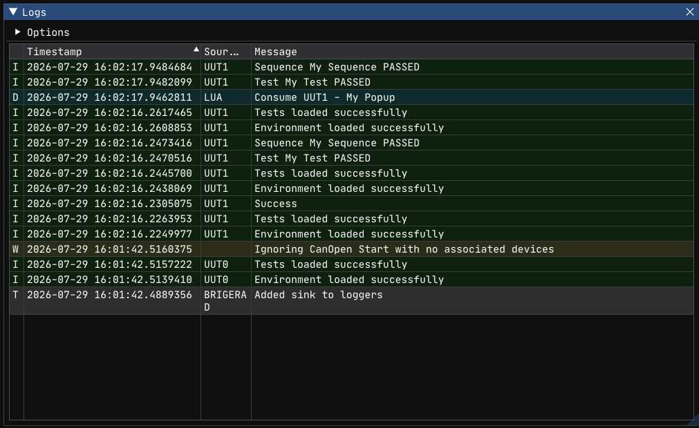

# Log Window



The Log Window displays a real-time stream of application log messages. It shows output from
the framework, the orchestrator, CANopen communication, and your Lua test scripts
(`Log.D/I/W/E`).

**Hotkey:** ++f2++

---

## Overview

The Log Window presents log entries in a table with five columns:

| Column | Description |
|---|---|
| **Level** | Severity (T, D, I, W, E, C) |
| **Timestamp** | When the message was produced |
| **Source** | Logger name (e.g., `UUT1`, `SlCan`, `Frasy`) |
| **Message** | The log message content |
| **Location** | Source file/function and line number |

Entries are color-coded by severity:

| Level | Color | Meaning |
|---|---|---|
| Trace | Light gray | Extremely verbose internal diagnostics |
| Debug | Cyan | Development-time information |
| Info | Green | Normal operational messages |
| Warning | Yellow | Unexpected but non-fatal situations |
| Error | Red | Failures affecting test results |
| Critical | Bright red (white text) | Unrecoverable errors |

---

## Features

### Scrolling

When **AutoScroll** is enabled (default), the window always scrolls to the newest entry.
Disable it to freeze the view and inspect older messages.

### Column Visibility

Right-click the table header to show or hide columns. You can toggle:

- Timestamp
- Source (logger name)
- Location (source file/line)

The Level and Message columns are always visible.

### Column Reordering and Resizing

Drag column headers to reorder them. Drag column borders to resize.

---

## Options

Expand the **Options** tree at the top of the panel to configure per-logger log levels.

Each registered logger (e.g., `UUT1`, `SlCan`, `Frasy`, `APP`) appears with a dropdown to set
its minimum level. Messages below the selected level are hidden.

| Level | Value | Passes Through |
|---|---|---|
| Trace | 0 | Everything |
| Debug | 1 | Debug and above |
| Info | 2 | Info and above |
| Warn | 3 | Warn and above |
| Error | 4 | Error and above |
| Critical | 5 | Critical only |

Changes are persisted to `config.json` immediately.

---

## Display Modes

### Combined (Default)

All loggers are shown in a single unified list. The **Source** column identifies which logger
produced each entry. This is the best mode for seeing the overall flow of execution.

### Separate

Each logger gets its own tab. Switch between tabs to focus on a specific logger's output.
Useful when debugging a specific subsystem (e.g., only CANopen traffic).

The mode is controlled by the `CombineLoggers` config option.

---

## Source Location Styles

The Location column can render source information in different formats:

| Style | Format | Example |
|---|---|---|
| Function | `{function}` | `MeasureVoltage` |
| Function + Line | `{function}:{line}` | `MeasureVoltage:42` |
| File | `{file}` | `daq.lua` |
| File + Line | `{file}:{line}` | `daq.lua:42` |
| All (default) | `{function}:{line} ({file})` | `MeasureVoltage:42 (daq.lua)` |

Configure via `SourceLocationRenderStyle` in `config.json` (values 0–4).

---

## Configuration

The Log Window's state is stored in the `LogWindow` key of `config.json`:

```json
"LogWindow": {
    "AutoScroll": true,
    "CombineLoggers": true,
    "EntriesToShow": 4096,
    "ShowLevels": [true, true, true, true, true, true, true],
    "Loggers": {
        "SlCan": 2
    },
    "ShowLogSource": true,
    "ShowSourceLocation": true,
    "ShowTimeStamp": true,
    "SourceLocationRenderStyle": 4
}
```

| Key | Type | Default | Description |
|---|---|---|---|
| `AutoScroll` | bool | `true` | Auto-scroll to newest entry |
| `CombineLoggers` | bool | `true` | Show all loggers in one view vs. separate tabs |
| `EntriesToShow` | int | `4096` | Max entries kept in memory (circular buffer) |
| `ShowLevels` | bool[7] | all true | Per-level visibility toggles |
| `Loggers` | object | `{}` | Per-logger minimum level overrides |
| `ShowLogSource` | bool | `true` | Show the Source column |
| `ShowSourceLocation` | bool | `true` | Show the Location column |
| `ShowTimeStamp` | bool | `true` | Show the Timestamp column |
| `SourceLocationRenderStyle` | int | `4` | Location format (0–4, see table above) |

---

## Tips

- **Reduce noise with per-logger levels.** Set `SlCan` to `info` or `warn` if low-level
  communication traffic is drowning out test messages.
- **Use the filter during debugging.** Type a test name or measurement label to quickly find
  relevant entries.
- **Increase `EntriesToShow` for long runs.** If you're running hundreds of tests and need to
  scroll back, increase the buffer size (at the cost of memory).
- **Open with ++f2++ after a failure.** The Log Window often contains the first clue about
  what went wrong — hardware timeouts, assertion details, or error messages from the framework.

---

## See Also

- [Logging](../lua-reference/logging.md) — `Log.D/I/W/E` API reference
- [Configuration](../developer-guide/configuration.md) — full `config.json` documentation
