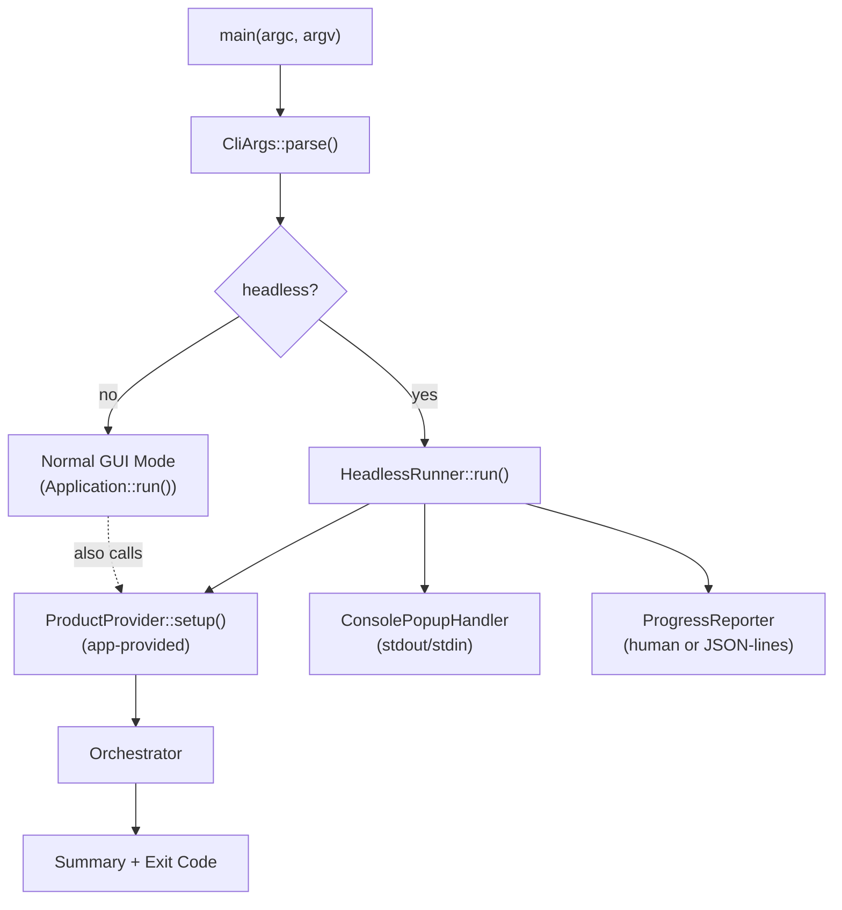

# Implementation Plan - Headless CLI Mode for Frasy

## Problem Statement

Frasy currently requires a GUI window to run tests. We need a `--headless` mode at the framework level that enables running tests from the command line with console-based progress, text-based popup interaction (for CI/CD, operator scripting, and AI agents), and report examination.

## Requirements

1. CLI: `frasy.exe --headless --product "MyProduct" --operator "CI" --serial "SN001" --serial "SN002"`
2. Multiple UUT support via repeated `--serial` flags
3. Config from `config.json` by default, overridable via `--config path`
4. CLI flags override config for product/operator/serial
5. Console-based progress: human-readable default, JSON-lines via `--output-format json`
6. Text-based popup interaction: stdout prompts, stdin responses (numbered inputs, typed button labels)
7. Full results saved to disk (existing formats), summary to stdout
8. Exit codes: 0=all pass, 1=any failure, 2=error
9. Framework-level: all Frasy apps get headless support
10. Applications provide a `ProductProvider` that encapsulates product-specific orchestrator setup, shared between GUI and headless paths
11. Serial number validation via `ProductProvider::validateSerialNumber`
12. Popup timeout via `--popup-timeout <seconds>` flag

## Architecture



## Task Breakdown

### Task 1: CLI Argument Parser

**Objective:** Add a command-line argument parser to the Frasy framework that detects `--headless` and extracts all relevant flags before the application runs.

**Implementation guidance:**

- Create `Frasy/src/utils/cli/cli_args.h` and `cli_args.cpp`
- Define a `CliArgs` struct:
  ```cpp
  namespace Frasy {
  struct CliArgs {
      bool headless = false;
      std::string product;
      std::string operatorName;
      std::vector<std::string> serials;
      std::string configPath = "config.json";
      std::string outputFormat = "human";  // "human" or "json"
      std::string outputDir = "logs";
      bool skipVerification = false;
      int popupTimeoutSeconds = 0;  // 0 = no timeout

      static CliArgs parse(int argc, char** argv);
      static CliArgs& get();  // global access after parse
  };
  }
  ```
- Use a simple hand-rolled parser (iterate argv, match `--flag` and `--flag value` patterns). No external dependency.
- Store the parsed result in a static/global accessible via `CliArgs::get()`
- Validate in headless mode: `--product` is required; `--operator` and at least one `--serial` are required
- Print usage/help on `--help` and exit
- Non-headless mode ignores all headless-specific flags gracefully
- Supported flags:
  - `--headless` — enable headless mode
  - `--product <name>` — product to test
  - `--operator <name>` — operator name
  - `--serial <sn>` — serial number (repeatable, one per UUT)
  - `--config <path>` — config file path (default: config.json)
  - `--output-format <human|json>` — console output format
  - `--output-dir <path>` — output directory for reports
  - `--skip-verification` — skip hash verification stage
  - `--popup-timeout <seconds>` — auto-cancel popups after N seconds (0 = wait forever)
  - `--help` — print usage and exit

**Test requirements:**

- Unit test: each flag is parsed correctly from a mock argv
- Unit test: missing required flags in headless mode produce clear error messages to stderr
- Unit test: repeated `--serial` flags accumulate into the vector
- Unit test: non-headless mode returns defaults even with extra flags present
- Unit test: `--help` outputs usage text

---

### Task 2: Entry Point Integration and Interpreter Registration

**Objective:** Modify the Brigerad entry point to parse CLI args first and branch to headless mode, and add the `ProductProvider` registration mechanism to `Frasy::Interpreter` so applications can register their provider.

**Implementation guidance:**

**Modify `Frasy::Interpreter` (`Frasy/src/frasy_interpreter.h`):**

```cpp
#include "utils/headless/product_provider.h"
#include <memory>

namespace Frasy {
class Interpreter : public Brigerad::Application {
public:
    // ... existing members ...

    void setProductProvider(std::unique_ptr<Headless::ProductProvider> provider);
    Headless::ProductProvider* getProductProvider();

private:
    std::unique_ptr<Headless::ProductProvider> m_productProvider;
};
}
```

**Implement in `frasy_interpreter.cpp`:**

```cpp
void Interpreter::setProductProvider(std::unique_ptr<Headless::ProductProvider> provider) {
    m_productProvider = std::move(provider);
}

Headless::ProductProvider* Interpreter::getProductProvider() {
    return m_productProvider.get();
}
```

**Modify `Brigerad/src/Brigerad/Core/EntryPoint.h`:**

```cpp
#include <utils/cli/cli_args.h>

int main(int argc, char** argv) {
    auto& cliArgs = Frasy::CliArgs::parse(argc, argv);

    BR_BEGIN_GUARDED_SCOPE
    {
        BR_PROFILE_BEGIN_SESSION("Init", "BrigeradProfile-Startup.json");
        cpptrace::register_terminate_handler();
        cpptrace::absorb_trace_exceptions(true);
        Brigerad::Log::Init();
        Brigerad::_internalDoNotUse::initExceptionHandling();
        BR_PROFILE_END_SESSION();

        auto app = Brigerad::CreateApplication(argc, argv);

        if (cliArgs.headless) {
            // HeadlessRunner include and logic added in Task 4
            // For now, just log and exit to enable testing
            BR_CORE_INFO("Headless mode activated for product: {}", cliArgs.product);
            delete app;
            return 0;
        }

        app->run();

        BR_PROFILE_BEGIN_SESSION("Shutdown", "BrigeradProfile-Shutdown.json");
        delete app;
        BR_PROFILE_END_SESSION();
    }
    BR_END_GUARDED_SCOPE
}
```

Note: The `HeadlessRunner` call is stubbed initially (logs and exits). Task 4 fills in the real runner. This lets us immediately test that:
- `--headless` flag is detected and branches correctly
- Normal mode (no flags) works exactly as before
- `ProductProvider` can be registered and retrieved

**Why this must come early:**
- Without this, we can't test any headless behavior by running the exe
- The hidden window (Task 3) needs the branch to be in place
- The `ProductProvider` registration needs to exist before the runner (Task 4) can use it

**Access pattern from application code:**

```cpp
// Registration (in app's interpreter constructor):
setProductProvider(std::make_unique<DemoProductProvider>());

// Retrieval (from MainApplicationLayer, entry point, etc.):
Frasy::Interpreter::Get().getProductProvider();
```

**Test requirements:**

- Test: `frasy.exe --headless --product test --operator CI --serial SN001` hits the headless branch, prints log, exits 0
- Test: `frasy.exe` (no flags) launches normally in GUI mode
- Test: `setProductProvider` stores and `getProductProvider` retrieves correctly
- Test: calling `getProductProvider` before registration returns `nullptr`

---

### Task 3: Hidden Window Mode in Brigerad

**Objective:** Allow `Brigerad::Application` to create a hidden (invisible) GLFW window when headless mode is active, so the app initializes without showing UI.

**Implementation guidance:**

- Add `bool visible = true` to `WindowProps`
- In `WindowsWindow::Init()`, before `glfwCreateWindow`, add:
  ```cpp
  if (!props.visible) { glfwWindowHint(GLFW_VISIBLE, GLFW_FALSE); }
  ```
- Modify `Brigerad::Application` constructor to read from `Frasy::CliArgs::get().headless` and pass `visible = !headless` to `WindowProps`
- The OpenGL context still initializes (some framework code may depend on it), but no window is shown
- The `Application::run()` main loop still starts — it will be cut short by `HeadlessRunner` calling `close()` after tests complete

**Test requirements:**

- Verify the application starts and shuts down cleanly with `visible = false`
- Verify no window flashes on screen during headless startup and shutdown
- Verify that normal (non-headless) mode is completely unaffected

---

### Task 4: ProductProvider Interface and HeadlessRunner Core

**Objective:** Define the `ProductProvider` interface that applications implement for product-specific orchestrator setup, and build the `HeadlessRunner` class that drives the full headless test lifecycle.

**Implementation guidance:**

**ProductProvider interface** (`Frasy/src/utils/headless/product_provider.h`):

```cpp
namespace Frasy::Headless {

class ProductProvider {
public:
    virtual ~ProductProvider() = default;

    /// Validate a serial number for this product.
    /// Returns true if the serial is valid, false otherwise.
    virtual bool validateSerialNumber(const std::string& serial) = 0;

    /// Set up the orchestrator and CANopen for the given product.
    /// Responsibilities:
    ///   1. Select product-specific configuration
    ///   2. Call orchestrator.setLoadUserValues(...)
    ///   3. Call orchestrator.loadUserFiles(envPath, testsDir)
    ///   4. Configure CANopen nodes from the IB map
    ///   5. Start CANopen
    ///   6. Call orchestrator.setLoadUserFunctions(...)
    /// Returns true on success.
    virtual bool setup(Lua::Orchestrator& orchestrator,
                       CanOpen::CanOpen& canOpen,
                       const std::string& product,
                       const std::string& envPath,
                       const std::string& testsDir) = 0;

    /// Called after test execution completes. Optional hook for
    /// post-test actions (e.g., report sending, LED signaling).
    virtual void onTestComplete(Lua::Orchestrator& orchestrator) {}
};

} // namespace Frasy::Headless
```

**HeadlessRunner** (`Frasy/src/utils/headless/headless_runner.h` and `.cpp`):

```cpp
namespace Frasy::Headless {

class HeadlessRunner {
public:
    HeadlessRunner(const CliArgs& args, ProductProvider& provider);

    /// Run the full headless test lifecycle. Returns exit code (0/1/2).
    int run();

private:
    struct ProductInfo {
        std::string environmentPath;
        std::string testPath;
        std::string name;
    };

    std::vector<ProductInfo> discoverProducts();
    bool validateArgs();
    bool validateSerials();
    int reportResults();

    const CliArgs& m_args;
    ProductProvider& m_provider;
    Lua::Orchestrator m_orchestrator;
    CanOpen::CanOpen m_canOpen;
};

} // namespace Frasy::Headless
```

**HeadlessRunner::run() flow:**

1. Load config from `m_args.configPath`
2. Discover products by scanning `lua/user/` (same pattern as existing `detectProducts`)
3. Validate the requested product exists; if not, print available products and return 2
4. Validate serial numbers via `m_provider.validateSerialNumber()` for each serial; print error and return 2 if any fail
5. Call `m_provider.setup(m_orchestrator, m_canOpen, product, envPath, testsDir)`; return 2 on failure
6. Validate serial count matches UUT count from loaded environment; return 2 on mismatch
7. Install console popup handler (Task 5)
8. Start progress reporter (Task 6)
9. Call `m_orchestrator.runSolution(operator, serials, regenerate=true, skipVerification)` and wait for completion (poll `isRunning()` in a loop, drive popup handler during wait)
10. Call `m_provider.onTestComplete(m_orchestrator)`
11. Report results and return exit code (Task 7)

**Update `EntryPoint.h`** (replace the stub from Task 2):

```cpp
if (cliArgs.headless) {
    auto* provider = Frasy::Interpreter::Get().getProductProvider();
    if (!provider) {
        BR_CORE_ERROR("No ProductProvider registered for headless mode");
        delete app;
        return 2;
    }
    Frasy::Headless::HeadlessRunner runner(cliArgs, *provider);
    int exitCode = runner.run();

    BR_PROFILE_BEGIN_SESSION("Shutdown", "BrigeradProfile-Shutdown.json");
    delete app;
    BR_PROFILE_END_SESSION();
    return exitCode;
}
```

**Note on orchestrator/canOpen ownership:** In headless mode, the `HeadlessRunner` owns its own `Orchestrator` and `CanOpen` instances. The `MainApplicationLayer`'s instances are never used (the layer may be constructed by the app's interpreter but `onAttach` won't be called since `run()` is bypassed).

**Test requirements:**

- Unit test: `discoverProducts()` finds products in a mock `lua/user/` directory
- Unit test: serial validation rejects invalid serials and reports which ones failed
- Unit test: serial count mismatch with UUT count is caught
- Unit test: a mock `ProductProvider` exercises the full `run()` flow
- Integration test: headless run with demo_mode product exercises generation and validation stages

---

### Task 5: Console Popup Handler

**Objective:** Implement a headless popup handler that presents popup content via stdout and reads operator/agent input via stdin, with timeout support.

**Implementation guidance:**

- Create `Frasy/src/utils/headless/console_popup_handler.h` and `.cpp`
- Provides an alternative `importPopup` implementation for headless `Stage::execution`:
  ```cpp
  void importHeadlessPopup(sol::state_view lua, std::size_t uut,
                           const std::string& outputFormat,
                           int timeoutSeconds,
                           std::mutex& ioMutex);
  ```

**Popup presentation — Human format:**

```
╔══════════════════════════════════════╗
║ POPUP: "Confirm Fixture" (UUT 1)    ║
╠══════════════════════════════════════╣
║ Place the board in the fixture       ║
║ Ensure all pins are seated           ║
║                                      ║
║ Inputs:                              ║
║   [1] Serial Number: _               ║
║   [2] Batch Code: _                  ║
║                                      ║
║ Buttons: [OK] [Cancel]               ║
╚══════════════════════════════════════╝
Action>
```

**Popup presentation — JSON format:**

```json
{"type":"popup","id":"popup_UUT1_Confirm Fixture","uut":1,"name":"Confirm Fixture","texts":["Place the board in the fixture","Ensure all pins are seated"],"inputs":[{"index":1,"title":"Serial Number","value":""},{"index":2,"title":"Batch Code","value":""}],"buttons":["OK","Cancel"]}
```

**User interaction protocol (stdin):**

| Command | Effect |
|---|---|
| `<number>=<value>` | Sets input field #number to value (e.g., `1=SN12345`) |
| `<ButtonLabel>` | Clicks the button with that label (case-insensitive) |
| `?` | Re-displays the popup (human mode only, useful for dynamic text updates) |

Human mode example interaction:

```
Action> 1=SN12345
  ✓ Input 1 (Serial Number) = "SN12345"
Action> 2=BATCH001
  ✓ Input 2 (Batch Code) = "BATCH001"
Action> OK
  → Popup consumed.
```

JSON mode response (single line on stdin):

```json
{"id":"popup_UUT1_Confirm Fixture","inputs":{"1":"SN12345","2":"BATCH001"},"button":"OK"}
```

**Multi-UUT popup serialization:**

- Multiple UUTs can trigger popups simultaneously. They are queued and presented one at a time (protected by `ioMutex`).
- In human mode, show `[N more popups queued]` header if others are waiting.
- In JSON mode, each popup gets a unique `id`. Responses must match the `id` of the currently active popup.

**Timeout behavior:**

- If `--popup-timeout <seconds>` is set and no response is received within that time:
  - The popup is auto-cancelled (equivalent to clicking the cancel/consume button)
  - Human mode: prints `  ⚠ Popup timed out after Ns, auto-cancelled.`
  - JSON mode: emits `{"type":"popup_timeout","id":"...","timeout_seconds":30}`
- Timeout of 0 means wait forever (default)

**Dynamic text (TextDynamic) handling:**

- The popup's `Routine` callback is called periodically while waiting for input
- In human mode: if dynamic text changes, reprint the popup on `?` command
- In JSON mode: emit periodic `{"type":"popup_update","id":"...","dynamic_texts":["current value"]}` lines (every ~1s if changed)

**Thread safety:**

- The popup handler runs on the Lua worker thread for each UUT
- stdin/stdout access protected by the shared `ioMutex`
- When a popup is active, the handler holds the mutex, blocking other UUTs' popups until it's consumed

**Test requirements:**

- Unit test: popup text/input/button extraction from a mock sol::table builder
- Unit test: human-format output string matches expected format
- Unit test: JSON-format output is valid JSON with expected fields
- Unit test: timeout triggers auto-cancel after configured seconds
- Integration test with piped stdin: provide responses and verify popups consume correctly
- Test: multiple queued popups are serialized correctly

---

### Task 6: Progress Reporter

**Objective:** Implement real-time progress output to the console showing test execution status per UUT.

**Implementation guidance:**

- Create `Frasy/src/utils/headless/progress_reporter.h` and `.cpp`
- The reporter runs as a polling thread started before `runSolution` and joined after completion
- Monitors:
  - UUT state changes via `orchestrator.getUutState(uut)`
  - Expectation results via `orchestrator.getExpectationsMutex/Vector` (for per-test results)
- Polling interval: ~100ms

**Human-readable format:**

```
[10:34:56] Starting: product="MyProduct" operator="CI" uuts=2
[10:34:56] [UUT1] SN001 — Running
[10:34:57] [UUT1] ✓ Power On > Check Supply Voltage (PASS, 0.42s)
[10:34:57] [UUT2] ✗ Power On > Check Supply Voltage (FAIL)
[10:34:58] [UUT1] ✓ Power On > Check Current Draw (PASS, 0.31s)
[10:34:58] [UUT2] — Power On > Check Current Draw (SKIPPED)
```

**JSON-lines format:**

```json
{"type":"run_start","product":"MyProduct","operator":"CI","uuts":2,"serials":["SN001","SN002"],"timestamp":"2026-08-05T10:34:56"}
{"type":"uut_state","uut":1,"serial":"SN001","state":"running","timestamp":"..."}
{"type":"test_result","uut":1,"sequence":"Power On","test":"Check Supply Voltage","pass":true,"duration":0.42,"timestamp":"..."}
{"type":"test_result","uut":2,"sequence":"Power On","test":"Check Supply Voltage","pass":false,"duration":0.38,"timestamp":"..."}
{"type":"uut_state","uut":1,"serial":"SN001","state":"passed","timestamp":"..."}
{"type":"uut_state","uut":2,"serial":"SN002","state":"failed","timestamp":"..."}
```

**Implementation details:**

- Track expectation vector size per UUT to detect new test completions
- Use the Solution model to map expectation indices back to sequence/test names
- stdout output must not interfere with popup I/O — use the same `ioMutex` from the popup handler
- Lua `Log.I/W/E` messages already go through spdlog's stdout sink — verify they appear correctly interleaved with progress output

**Test requirements:**

- Unit test: human-format strings are correct for various state transitions
- Unit test: JSON-format output is valid JSON with expected fields
- Test: concurrent UUT state changes produce interleaved but coherent output
- Test: progress output does not corrupt popup interaction (mutex works)

---

### Task 7: Report Summary and Exit Codes

**Objective:** After test execution, print a concise summary to stdout, ensure reports are on disk, and return the correct exit code.

**Implementation guidance:**

- After `runSolution` completes and `onTestComplete` is called in `HeadlessRunner`:
  1. Read each UUT's JSON report from `{outputDir}/last/{uut}.json`
  2. Determine overall result from UUT states
  3. Print summary

**Human format:**

```
═══════════════════════════════════════
 Test Results: MyProduct
═══════════════════════════════════════
 UUT1 (SN001): PASS    [2/2 tests, 1.2s]
 UUT2 (SN002): FAIL    [1/2 tests, 1.3s]
───────────────────────────────────────
 Overall: FAIL
 Reports: logs/last/1.json, logs/last/2.json
═══════════════════════════════════════
```

**JSON format:**

```json
{"type":"run_end","overall_pass":false,"uuts":[{"uut":1,"serial":"SN001","pass":true,"tests_passed":2,"tests_total":2,"duration":1.2,"report":"logs/last/1.json"},{"uut":2,"serial":"SN002","pass":false,"tests_passed":1,"tests_total":2,"duration":1.3,"report":"logs/last/2.json"}]}
```

**Exit codes:**

- `0` — all enabled UUTs passed
- `1` — one or more UUTs failed (test expectation failures)
- `2` — error (orchestrator crash, generation/validation failure, hardware timeout, missing product, invalid serial, setup failure)

**Reports on disk:** The orchestrator's existing `checkResults` already copies reports to `logs/{title}/pass/` or `logs/{title}/fail/`. Verify this works in headless mode without changes.

**Test requirements:**

- Unit test: exit code determination from various UUT state combinations
- Unit test: human summary format matches expected output
- Unit test: JSON summary is valid JSON with all fields
- Test: missing report file (orchestrator crashed mid-run) produces exit code 2
- Test: all-pass scenario returns 0, mixed returns 1

---

### Task 8: Demo Application and Shared Logic Refactor

**Objective:** Update the demo_mode application to demonstrate headless support and show the shared-logic pattern where `ProductProvider::setup()` is used by both GUI and headless paths.

**Implementation guidance:**

**Update demo_mode application (`demo_mode/src/my_frasy_interpreter.cpp`):**

```cpp
#include <utils/headless/product_provider.h>

class DemoProductProvider : public Frasy::Headless::ProductProvider {
public:
    bool validateSerialNumber(const std::string& serial) override {
        return !serial.empty();  // Demo: any non-empty serial is valid
    }

    bool setup(Frasy::Lua::Orchestrator& orchestrator,
               Frasy::CanOpen::CanOpen& canOpen,
               const std::string& product,
               const std::string& envPath,
               const std::string& testsDir) override {
        if (!orchestrator.loadUserFiles(envPath, testsDir)) return false;

        canOpen.stop();
        canOpen.clearNodes();
        const auto& [ibs, uuts, teams] = orchestrator.getMap();
        for (const auto& [kind, nodeId, name, edsPath, od] : ibs) {
            canOpen.addNode(nodeId, name, edsPath);
        }
        canOpen.start();
        return true;
    }
};

class MyFrasyInterpreter : public Frasy::Interpreter {
public:
    MyFrasyInterpreter() : Interpreter("Frasy - Demo Mode") {
        setProductProvider(std::make_unique<DemoProductProvider>());
        pushLayer(new MyMainApplicationLayer());
    }
};
```

**Refactor `MyMainApplicationLayer::makeOrchestrator`** to call the same provider:

```cpp
void MyMainApplicationLayer::makeOrchestrator(const std::string& name,
                                              const std::string& envPath,
                                              const std::string& testPath) {
    auto* provider = Frasy::Interpreter::Get().getProductProvider();
    if (provider && provider->setup(m_orchestrator, m_canOpen, name, envPath, testPath)) {
        m_activeProduct = name;
        const auto& [ibs, uuts, teams] = m_orchestrator.getMap();
        m_serials.clear();
        m_serials.resize(uuts.size() + 1, {});
        m_serialsFields.clear();
        m_serialsFields.resize(uuts.size() + 1, {});
    } else {
        Brigerad::warningDialog("Frasy", "Unable to initialize orchestrator!");
        makeLogWindowVisible();
        BR_LOG_ERROR("APP", "Unable to initialize orchestrator!");
    }
}
```

**Test requirements:**

- End-to-end test: `frasy.exe --headless --product popup --operator CI --serial SN001` runs the demo product
- Test: normal GUI mode (`frasy.exe` with no flags) works exactly as before
- Test: `--headless` without `--product` prints error and available products, returns 2
- Test: `--headless` with non-existent product prints available products, returns 2
- Test: `--headless` with invalid serial prints error, returns 2
- Test: application without a registered ProductProvider prints error, returns 2

**Demo:** The demo_mode application works in both modes:

- `frasy.exe` → GUI as usual
- `frasy.exe --headless --product popup --operator CI --serial SN001` → runs tests in console, prints results, exits with code 0 or 1

---

### Task 9: Documentation

**Objective:** Document the headless CLI mode for end-users and developers.

**Implementation guidance:**

**Add `docs/getting-started/headless-mode.md`:**

- Full CLI flag reference table
- Example invocations for common scenarios (CI, operator scripting, AI agent)
- Output format examples (human + JSON-lines)
- Exit code meanings
- Popup interaction protocol:
  - Human mode: numbered input commands, button label commands, `?` to refresh
  - JSON mode: request/response format with `id` field
  - Timeout behavior
- Example: driving Frasy from a Python script
- Example: driving Frasy from an AI agent (JSON mode)

**Add `docs/developer-guide/headless-mode.md`:**

- How to implement `ProductProvider`:
  - `validateSerialNumber` — what to check
  - `setup` — responsibilities and order of operations
  - `onTestComplete` — post-test hooks
- How to register the provider in your application's interpreter
- How to refactor existing `makeOrchestrator` to use `ProductProvider::setup()` for both GUI and headless paths
- Migration guide with before/after code examples
- Testing headless mode during development

**Update `mkdocs.yml` nav:**

```yaml
- Getting Started:
    # ... existing entries ...
    - Headless Mode: getting-started/headless-mode.md
- Developer Guide:
    # ... existing entries ...
    - Headless Mode: developer-guide/headless-mode.md
```

**Add brief mention in `docs/architecture/overview.md`** about the headless execution path as an alternative to the GUI main loop.

**Test requirements:**

- Documentation builds without errors via `mkdocs build`
- All code examples are syntactically valid C++/JSON/shell
